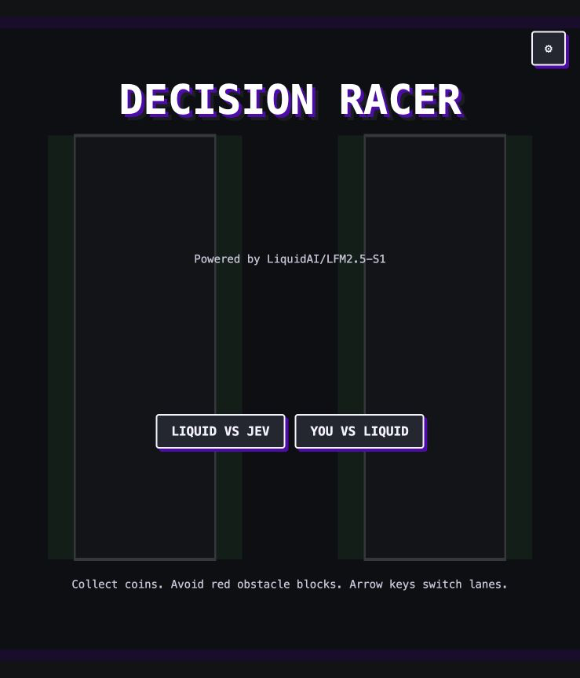

# Road Decider

[](https://discord.com/invite/liquid-ai)

**A pixel-art survival racer powered by Liquid Decision Models.**



Watch Liquid's decision model race head-to-head against Jev, or take the wheel yourself and try to beat the AI. Every AI lane change is a real-time System One decision: no scripted moves, no recorded answers.

## How It Works

Each decision tick, the model receives a compact road state: current lane, the next three rows of traffic vehicles, and speed tier. It returns one choice: left, center, or right. The confidence bar shows the selected lane probability so you can watch calibration under pressure.

Each racer has three lives. Hitting traffic costs one life, pauses briefly, then respawns the car in the center lane with a short invulnerability window. There is no finish line: the road keeps getting faster until one contender loses all three lives.

Built with [LiquidAI/LFM2.5-S1](https://docs.liquid.ai/lfm/models/decision-models) using the System One API. Jev mode uses OpenRouter's `typesafe/jev-1.13` decision model through the Decisions endpoint.

## Play Modes

| Mode | Description |
|------|-------------|
| **Liquid vs Jev** | Both cars are AI-controlled. Watch the models race on the same seeded road. |
| **You vs Liquid** | Liquid stays on the left while you drive the right road with arrow keys. |

## Prerequisites

- Node.js 18+
- A Liquid API key in `/Users/leonie/Documents/code/decision/.env` as `LIQUID_API_KEY=...`
- Optional: set `LIQUID_MODEL=...` in the same `.env` if your Liquid console uses a different System One model ID
- An OpenRouter API key in your shell as `OPENROUTER_API_KEY=...` for Liquid vs Jev mode

## Run Locally

```bash
npm install
npm run dev
```

Open [http://localhost:5173](http://localhost:5173). The Vite dev server proxies decision calls so API keys stay server-side. If a key is missing, the HUD shows the upstream API error with a hint to set the required environment variable before running Vite.

If the configured Liquid model is unavailable, the HUD shows the upstream error and the car uses a deterministic local fallback policy so the race remains playable while you update `LIQUID_MODEL`.

## Controls

| Key | Action |
|-----|--------|
| Left arrow | Switch to the left lane |
| Right arrow | Switch to the right lane |
| Enter | Start race / race again |

## Files

- `main.js`: mode selection and screen flow
- `game.js`: core loop, collision detection, AI ticks, results
- `road.js`: scrolling road, lane positions, seeded item waves
- `ai.js`: System One request builder and response normalization
- `sprites.js`: inline pixel art for cars, mascots, and traffic vehicles
