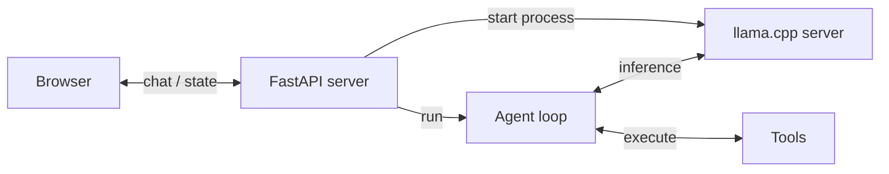
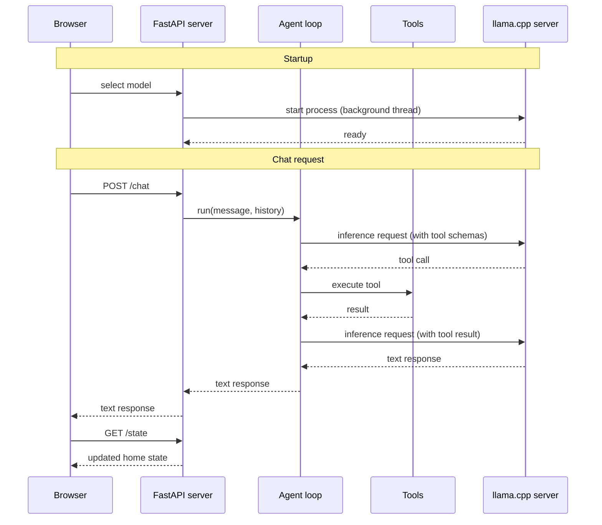
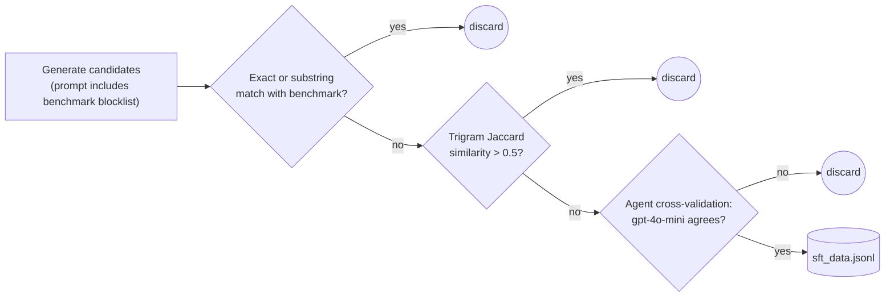
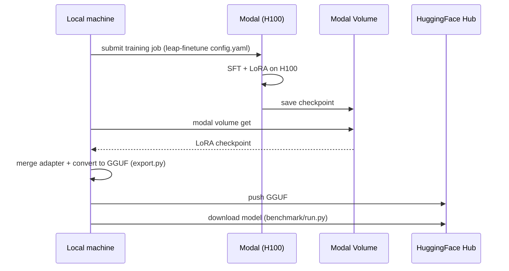

# Home Assistant powered by a local LFM

This project builds a home assistant system powered entirely by a local LFM model. The focus
is practical: every step of the journey is covered, from a first working prototype to a
fine-tuned model for tool calling running fully on your own hardware.

In this tutorial you will learn how to:

1. Build a [proof of concept](#step-1-build-a-proof-of-concept) for a fully local Home Assistant.
2. [Benchmark](#benchmark) its tool-calling accuracy so you have a clear baseline to improve on.
3. Generate [synthetic data](#step-3-generate-synthetic-data) for model fine-tuning.
4. [Fine-tune](#step-4-fine-tune-the-model) the model on this synthetic data to maximise accuracy using serverless GPUs by Modal.

## Quick start

**Requirements**

- [uv](https://docs.astral.sh/uv/getting-started/installation/) for running the Python app
- [llama.cpp](https://github.com/ggerganov/llama.cpp?tab=readme-ov-file#installation) for running the model locally (`llama-server` must be on your PATH)

**1. Start the app server**

```bash
uv run uvicorn app.server:app --port 5173 --reload
```

**2. Open the app**

```bash
open http://localhost:5173
```


The UI includes a model selector. When you pick a model, the app automatically downloads
and starts `llama-server` in the background. No manual model server setup is needed.

## Step 1: Build a proof of concept

The main components of our solution are: 

- **Browser** renders the UI and sends chat messages to the server
- **FastAPI server** handles HTTP requests, manages home state, and starts the llama.cpp server on model selection
- **Agent loop** drives the conversation, calls the model for inference, and dispatches tool calls
- **Tools** read and mutate the home state (lights, thermostat, doors, scenes)
- **llama.cpp server** runs the LFM model locally and exposes an OpenAI-compatible API



The brain of the system is a small language model (hello LFM!) that can map English sentences to the right tool calls.

- `toggle_lights`: turn lights on or off in a specific room
- `set_thermostat`: change the temperature and operating mode
- `lock_door`: lock or unlock a door
- `get_device_status`: read the current state of any device
- `set_scene`: activate a preset that adjusts multiple devices at once

and

- `intent_unclear`: the most important tool for robustness. The model must call it whenever the request falls outside what the system can handle, whether the request is ambiguous, off-topic (ordering food, asking about the weather), incomplete (a pronoun with no prior context like "turn it on"), or refers to an unsupported device like a TV or camera. Getting this tool right is what separates a reliable assistant from one that hallucinates actions.


The sequence diagram below shows how the system starts and processes a chat message step by step. Solid arrows are calls, dashed arrows are responses:



The FastAPI server, the agent loop, and the tools are all implemented in Python. That said, feel free to re-implement them in any other language for higher performance. Rust, for example, would be a good choice.

## Step 2: Benchmarking tool-calling accuracy <a name="benchmark"></a>

Play with the UI using one of the local models and you will quickly notice: 

- sometimes it works

  

- sometimes it doesn't.

  

That's fine for a proof of concept. But the full power of small language models only comes out
  when you fine-tune them.

  Before you fine-tune, though, you need to know where you stand. You need to measure. You cannot ship to production based on vibes or things that more or less work. You ship based on good benchmarks and evals.


### What's a good benchmark?

A good benchmark covers the space of possible inputs by systematic taxonomy, not intuition. Here is the methodology we use to build `benchmark/`, a 100-task suite designed from the ground up around these principles.

**1. Start with a taxonomy**

Define the input space BEFORE writing prompts. A taxonomy makes coverage gaps visible and prevents accidental clustering around the examples you happened to think of first.

Our taxonomy has three dimensions:

| Dimension | Values |
|-----------|--------|
| Capability | `lights`, `thermostat`, `doors`, `status`, `scene`, `rejection`, `multi_tool` |
| Phrasing | `imperative`, `colloquial`, `implicit`, `question` |
| Inference depth | `literal` (words map 1:1 to tool + args), `semantic` (requires translation), `boundary` (model must reject) |

**2. Sample from every cell**

The Cartesian product of those dimensions defines the universe of task types. Sample at least one task per non-empty cell. This forces you to write prompts you would not have thought of otherwise, such as 
- an implicit-semantic thermostat request ("It feels like a sauna in here") or
- a boundary-case door request ("Is the house secure right now?").

**3. Write programmatic verifiers**

Every task has a pure Python verifier that inspects

- the final `home_state` dict, or
- captured `tool_calls` for read-only and rejection tasks.

No LLM-as-judge. Deterministic, fast, cheap.

```python
# State check: was the right final state reached?
passed = state["lights"]["kitchen"]["state"] == "on"

# Tool-call check (for status queries and rejections): was the right tool called with the right args?
call = _find_last_call(tool_calls, "intent_unclear")
passed = call is not None and call["args"].get("reason") == "off_topic"
```

You can run the benchmark for a given model as follows:

```bash
uv run python benchmark/run.py \
    --hf-repo LiquidAI/LFM2.5-1.2B-Instruct-GGUF \
    --hf-file LFM2.5-1.2B-Instruct-Q4_0.gguf
```

**Run a single task by number (1-101)**, for example:

```bash
uv run python benchmark/run.py \
    --hf-repo LiquidAI/LFM2.5-1.2B-Instruct-GGUF \
    --hf-file LFM2.5-1.2B-Instruct-Q4_0.gguf \
    --task 5
```

It's also worth running the benchmark against a frontier model like GPT-4o-mini.

  Why? Because a frontier model scoring near-perfect tells you the agent harness is correct. The
  prompts, the tool schemas, the verification logic. If a state-of-the-art model doesn't pass almost
  everything, the problem is not the model. The problem is your code.


**Run against OpenAI gpt-4o-mini** (requires `OPENAI_API_KEY` in `.env`):

```bash
uv run python benchmark/run.py --backend openai
```

Results are printed to the console and saved as a Markdown file in `benchmark/results/`.

**Evaluation results**

| Model | Parameters | Score | Accuracy |
|-------|------------|-------|----------|
| gpt-4o-mini | n/a | 93/100 | 93% |
| LFM2.5-1.2B-Instruct Q4_0 | 1.2B | 71/100 | 71% |
| LFM2-350M Q8_0 | 350M | 28/100 | 28% |

These are not vibes anymore. These are actual numbers we can use to understand where we stand.

In the following sections, we will see how to improve the performance of our local LFM models to bridge the gap with gpt-4o-mini.


## Step 3: Generate synthetic data <a name="step-3-generate-synthetic-data"></a>

To fine-tune the model you need labelled training data. We generate it synthetically using a strong model like `gpt-4o-mini`.

However, we need to be careful to avoid contaminating our training dataset using examples from our benchmark. If our training dataset contains tasks which are too close to the ones from the benchmark, the language model will essentially memorise these examples. Our benchmark metrics will look great on paper, but once we deploy to production, the model will struggle and show poor performance.

The steps we will follow to generate high-quality synthetic data are the following: 


1. **Blocklist in the prompt.** Every benchmark utterance for the relevant taxonomy cell is listed in the generation prompt and the model is told not to reproduce them. This is the first line of defence, but not enough on its own: the model may still generate something very close without copying it word for word.

2. **Filter by exact or substring match.** Catches the obvious case where the generated sentence appears verbatim, or as a sub-phrase, inside a benchmark task. Fast and cheap to check.

3. **Filter by trigram similarity.** Catches the subtle case: a light paraphrase of a benchmark task. For example, if the benchmark has "Turn on the kitchen lights" and the generator produces "Please turn on the kitchen lights", step 2 passes it (no exact match) but the two sentences are functionally identical as training examples. Trigram similarity catches this by breaking both sentences into overlapping three-word chunks ("turn on the", "on the kitchen", "the kitchen lights", ...) and measuring what fraction of chunks they share. If more than half overlap, the candidate is discarded. No linguistic knowledge required, just word overlap.

4. **Agent cross-validation.** Each surviving candidate is run through the real agent. Only examples where the agent produces the expected tool call are kept. This filters out phrasings that are genuinely ambiguous or underspecified, regardless of how they were generated.



**Command to generate the synthetic data set** (requires `OPENAI_API_KEY` in `.env`):

The target is 500 examples distributed across the same taxonomy as the benchmark.

```bash
uv run python benchmark/datasets/generate.py --count 500 --output benchmark/datasets/sft_data.jsonl
```

Output goes to `benchmark/datasets/sft_data.jsonl` (gitignored). After generation the script prints a rejection breakdown and a coverage matrix so you can see exactly how many examples ended up in each taxonomy cell.

Before moving to fine-tuning, convert the dataset to the LFM2 text format the tokenizer expects (the raw file uses OpenAI's `tool_calls` format, which is different) and push it to HuggingFace as a dataset so Modal can pull it during training.

```bash
uv run --group finetune python finetune/prepare_data.py \
    --input benchmark/datasets/sft_data.jsonl
```

## Step 4: Fine-tune the model <a name="step-4-fine-tune-the-model"></a>

Fine-tuning adapts the base model to our specific task. Instead of retraining all weights from scratch, we use LoRA (Low-Rank Adaptation): a technique that injects a small set of trainable weight matrices on top of the frozen base model. This keeps GPU memory usage low and training fast, while still producing meaningful accuracy gains on the target task.

Training runs on [Modal](https://modal.com) (a serverless GPU cloud) via [leap-finetune](https://github.com/Liquid4All/leap-finetune), Liquid AI's open source fine-tuning tool. LoRA fine-tuning requires a GPU (a CPU would take hours or days), and Modal's serverless model makes it cost-effective: you spin up an H100, pay only for the minutes it runs, download the checkpoint when it's done, and everything else happens on your local machine.



### Steps

1. **One-time setup.** Clone and install `leap-finetune`, then authenticate with HuggingFace and Modal.

   ```bash
   git clone https://github.com/Liquid4All/leap-finetune
   cd leap-finetune && uv sync && cd -
   huggingface-cli login
   modal setup
   ```

2. **Kick off training on Modal.** Runs 5 epochs of LoRA SFT on an H100. Takes a few minutes and costs roughly $1.50.

   ```bash
   cd leap-finetune
   uv run leap-finetune ../finetune/configs/LFM2-350M.yaml
   ```

3. **Download the checkpoint** from the Modal Volume once training finishes.

   ```bash
   cd leap-finetune
   uv run modal volume get leap-finetune /outputs/home-assistant-350M ../finetune/output/350M-lora
   ```

4. **Export.** Merges the LoRA adapter into the base model, converts to GGUF, and pushes to HuggingFace. The script prints the exact `--hf-repo` and `--hf-file` flags to use in the next step.

   ```bash
   uv run --group export python finetune/export.py \
       --lora-path finetune/output/350M-lora \
       --output-path finetune/output/350M-merged \
       --push-to-hub \
       --quant-type q8_0
   ```

Re-run the benchmark using the `--hf-repo` and `--hf-file` flags printed by the export step:

```bash
uv run python benchmark/run.py \
    --hf-repo <your-hf-username>/home-assistant-LFM2-350M-GGUF \
    --hf-file LFM2-350M-q8_0.gguf
```

### Results

Fine-tuning moved the score from **28 to 47 (+19 points)**. The aggregate score understates how well it worked. Here is the breakdown by capability 

| Capability | Baseline | Fine-tuned |
|------------|----------|------------|
| lights | 25.0% | **87.5%** |
| scene | 0.0% | **80.0%** |
| doors | 56.2% | 56.2% |
| multi_tool | 8.3% | 33.3% |
| status | 0.0% | 30.0% |
| thermostat | 0.0% | 18.8% |
| rejection | 0.0% | **0.0%** |

Rejection is the only category that did not improve. These tasks require the model to call `intent_unclear` instead of acting, which is harder than it sounds. Consider a few examples:

```
"Dim the living room lights to 30%"   # looks like a valid lights command, but brightness isn't supported
"Turn it on"                           # no target device specified
"Make it nicer in here"               # ambiguous across lights, thermostat, and scene
"I want some background music"        # unsupported device
```

The model did well on everything else. Rejection is simply a data problem: the training set had too few examples of when to say no. You can fix this by generating a rejection-heavy dataset and fine-tuning again:

```bash
uv run python benchmark/datasets/generate.py --count 500 \
    --capability-weights rejection=5
```

## Next steps

The model learned across every phrasing style and inference depth. Lights went from 25% to 87.5%, on par with GPT-4o-mini. Scene went from 0% to 80%. The only dimension frozen at 0% is rejection, which maps to boundary-depth tasks where the model must call `intent_unclear` instead of taking an action. This is a data problem: the training set had too few rejection examples. Generate more with `--capability-weights rejection=5` and fine-tune again to close that gap.

---

As Fermat once wrote in the margin of his notebook: *"I have discovered a truly marvellous solution, but this README is too narrow to contain it."*

If you try it or need help, join the [Liquid AI Discord community](https://discord.gg/liquidai) and ask.
