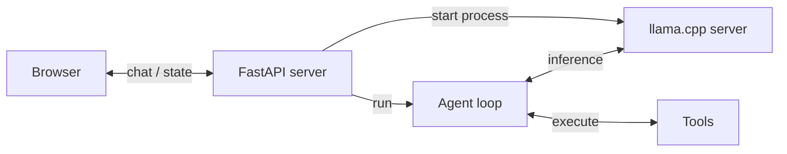
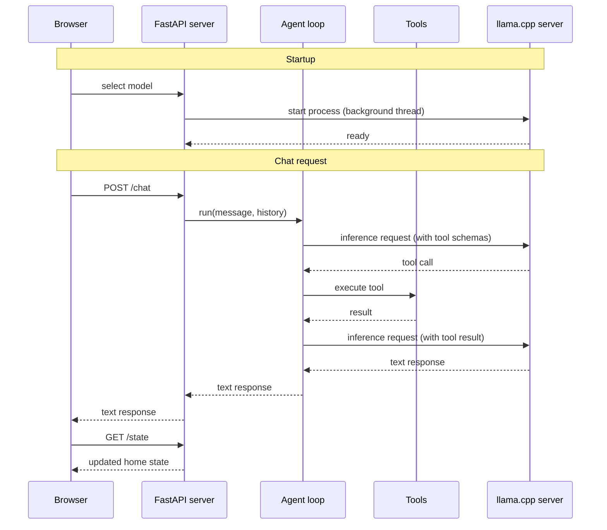
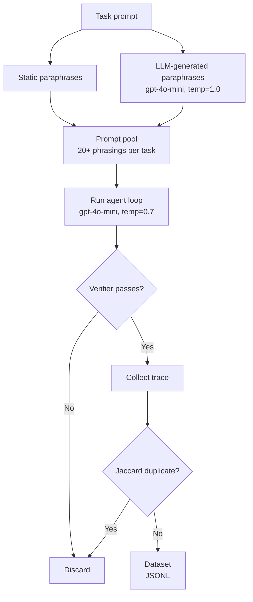

# Home Assistant powered by a local LFM

This project builds a home assistant system powered entirely by a local LFM model. The focus
is practical: every step of the journey is covered, from a first working prototype to a
fine-tuned model for tool calling running fully on your own hardware.

In this tutorial you will learn how to:

1. Build a [proof of concept](#step-1-build-a-proof-of-concept) for a fully local Home Assistant.
2. [Benchmark](#benchmark) its tool-calling accuracy so you have a clear baseline to improve on.
3. Generate [synthetic data](#step-3-generate-synthetic-data) for model fine-tuning.
4. [Fine-tune](#step-4-fine-tune-the-model) the model on this synthetic data to maximise accuracy.

## Quick start

**Requirements**

- [uv](https://docs.astral.sh/uv/getting-started/installation/) for running the Python app
- [llama.cpp](https://github.com/ggerganov/llama.cpp?tab=readme-ov-file#installation) for running the model locally (`llama-server` must be on your PATH)

**1. Start the app server**

```bash
uv run uvicorn app.server:app --port 5173 --reload
```

**3. Open the app**

```bash
open http://localhost:5173
```


The UI includes a model selector. When you pick a model, the app automatically downloads
and starts `llama-server` in the background. No manual model server setup is needed.

## Step 1: Build a proof of concept

The main components of our solution are: 

- **Browser** renders the UI and sends chat messages to the server
- **FastAPI server** handles HTTP requests, manages home state, and starts the llama.cpp server on model selection
- **Agent loop** drives the conversation, calls the model for inference, and dispatches tool calls
- **Tools** read and mutate the home state (lights, thermostat, doors, scenes)
- **llama.cpp server** runs the LFM model locally and exposes an OpenAI-compatible API



The brain of the system is a small language model (hello LFM!) that can map English sentences to the right tool calls.

- `toggle_lights`: turn lights on or off in a specific room
- `set_thermostat`: change the temperature and operating mode
- `lock_door`: lock or unlock a door
- `get_device_status`: read the current state of any device
- `set_scene`: activate a preset that adjusts multiple devices at once

and

- `intent_unclear`: the most important tool for robustness. The model must call it whenever the request falls outside what the system can handle, whether the request is ambiguous, off-topic (ordering food, asking about the weather), incomplete (a pronoun with no prior context like "turn it on"), or refers to an unsupported device like a TV or camera. Getting this tool right is what separates a reliable assistant from one that hallucinates actions.


The sequence diagram below shows how the system starts and processes a chat message step by step. Solid arrows are calls, dashed arrows are responses:



The FastAPI server, the agent loop, and the tools are all implemented in Python. That said, feel free to re-implement them in any other language for higher performance. Rust, for example, would be a good choice.

## Step 2: Benchmarking tool-calling accuracy <a name="benchmark"></a>

Local Small models give you solid accuracy out of the box. Not perfect, but solid. Good enough to build a proof of concept and see that the thing more or less works.

But production is a different story. You cannot ship to production based on vibes or things that more or less work. You ship based on good benchmarks and evals.

### What's a good benchmark?

A good benchmark covers the space of possible inputs by systematic taxonomy, not intuition. Here is the methodology we used to build `benchmark/`, a 100-task suite designed from the ground up around these principles.

**1. Start with a taxonomy**

Define the input space BEFORE writing prompts. A taxonomy makes coverage gaps visible and prevents accidental clustering around the examples you happened to think of first.

Our taxonomy has three dimensions:

| Dimension | Values |
|-----------|--------|
| Capability | `lights`, `thermostat`, `doors`, `status`, `scene`, `rejection`, `multi_tool` |
| Phrasing | `imperative`, `colloquial`, `implicit`, `question` |
| Inference depth | `literal` (words map 1:1 to tool + args), `semantic` (requires translation), `boundary` (model must reject) |

**2. Sample from every cell**

The Cartesian product of those dimensions defines the universe of task types. Sample at least one task per non-empty cell. This forces you to write prompts you would not have thought of otherwise, such as 
- an implicit-semantic thermostat request ("It feels like a sauna in here") or
- a boundary-case door request ("Is the house secure right now?").

**3. Write programmatic verifiers**

Every task has a pure Python verifier that inspects the final `home_state` dict (or captured `tool_calls` for read-only and rejection tasks). No LLM-as-judge. Deterministic, fast, cheap.

```python
# State check: was the right final state reached?
passed = state["lights"]["kitchen"]["state"] == "on"

# Tool-call check (for status queries and rejections): was the right tool called with the right args?
call = _find_last_call(tool_calls, "intent_unclear")
passed = call is not None and call["args"].get("reason") == "off_topic"
```

State verifiers are deliberately lenient about the path: a model that uses `set_scene` to turn off all the lights is still correct if the final state matches.

**4. Never share prompts between training and evaluation**

The same taxonomy that drives the benchmark can drive SFT dataset generation. The key constraint: you MUST never share specific prompt phrasings between the training split and the evaluation split. The taxonomy defines the distribution (shared), but each concrete prompt belongs exclusively to one split. If a model sees the exact evaluation prompt during training, the benchmark score becomes meaningless. In practice: generate train and eval prompts in separate sampling passes with distinct paraphrase templates, and treat the eval set as a held-out partition from day one.


You can run the benchmark for a given model as follows:

```bash
uv run python benchmark/run.py \
    --hf-repo LiquidAI/LFM2.5-1.2B-Instruct-GGUF \
    --hf-file LFM2.5-1.2B-Instruct-Q4_0.gguf
```

**Run a single task by number (1-101)**, for example:

```bash
uv run python benchmark/run.py \
    --hf-repo LiquidAI/LFM2.5-1.2B-Instruct-GGUF \
    --hf-file LFM2.5-1.2B-Instruct-Q4_0.gguf \
    --task 5
```

It's also worth running the benchmark against a frontier model like GPT-4o-mini.

  Why? Because a frontier model scoring near-perfect tells you the agent harness is correct. The
  prompts, the tool schemas, the verification logic. If a state-of-the-art model doesn't pass almost
  everything, the problem is not the model. The problem is your code.


**Run against OpenAI gpt-4o-mini** (requires `OPENAI_API_KEY` in `.env`):

```bash
uv run python benchmark/run.py --backend openai
```

Results are printed to the console and saved as a Markdown file in `benchmark/results/`.

**Evaluatiom results**

| Model | Parameters | Score | Accuracy |
|-------|------------|-------|----------|
| gpt-4o-mini | n/a | 93/100 | 93% |
| LFM2.5-1.2B-Instruct Q4_0 | 1.2B | 71/100 | 71% |
| LFM2-350M Q8_0 | 350M | 28/100 | 28% |

These are not vibes anymore. These are actual numbers we can use to understand where we stand.

In the following sections, we will see how to improve the performance of our local LFM models to match gpt-4o-mini.


## Step 3: Generate synthetic data <a name="step-3-generate-synthetic-data"></a>

To improve , you need training data. Real user data is slow to collect and hard to label. So we generate it synthetically: run a strong model (GPT-4o-mini) through the same 19 tasks, capture every trace where it succeeds, and use those to fine-tune the small model.

That is the idea. Let me show you how it works step by step.



**1. Build a prompt pool for each task**

Every task has a canonical prompt. "Turn on the kitchen lights." That is one phrase. One way a user might say it.

Real users say things differently. "Kitchen lights on please." "Can you switch on the kitchen lights?" "kithcen light on."

So for each task we expand the prompt pool in two ways. First, we include a set of hand-crafted static paraphrases. Then we ask GPT-4o-mini to generate more, passing the existing phrases as a negative seed so it actively avoids echoing them.

The result: 20+ distinct phrasings per task, spread across registers. Casual. Clipped. Formal. Frustrated. Short ones ("kitchen lights on"). Long ones. Some with typos or dropped words, as a real user might type.

**2. Run the agent and collect traces**

For each prompt we run the full agent loop using GPT-4o-mini as the backend. The home state is reset before each run and randomized where applicable, so the model does not always start from the same configuration. Temperature is set to 0.7 so repeated runs on the same prompt produce different traces.

```python
# Each run captures the full conversation: system prompt, user message,
# tool calls, tool results, and final text reply.
collect_example(task, prompt, backend="openai", temperature=0.7)
```

**3. Verify and keep only correct traces**

Each trace is checked by the same verifier used in the benchmark. Wrong tool, wrong arguments, too many tool calls: the trace is discarded.

Only correct traces make it into the dataset. You are not teaching the model from noisy data. You are teaching it from verified, correct behavior.

**4. Deduplicate**

After collection, a Jaccard deduplication pass removes near-identical examples. Any two examples sharing more than 80% of their word bigrams are considered duplicates and only one is kept.

This keeps the dataset lean. You want diversity, not repetition.

**5. Save the dataset**

The output is a timestamped JSONL file saved to `benchmark/datasets/`. Each line is one training example: a full conversation trace paired with the tool schemas used during that run.

```json
{
  "task_id": 1,
  "difficulty": "easy",
  "messages": [
    {"role": "system",    "content": "..."},
    {"role": "user",      "content": "Kitchen lights on please"},
    {"role": "assistant", "content": null, "tool_calls": [...]},
    {"role": "tool",      "content": "{\"status\": \"on\"}"},
    {"role": "assistant", "content": "The kitchen lights are now on."}
  ],
  "tools": [...]
}
```

This is exactly the format the fine-tuning script expects in the next step.

**Quick sanity check**

```bash
uv run python benchmark/generate_dataset.py --runs 1 --n-paraphrases 3
```

**Full dataset generation** (requires `OPENAI_API_KEY` in `.env`)

```bash
uv run python benchmark/generate_dataset.py --runs 5 --n-paraphrases 10
```

## Step 4: Fine-tune the model <a name="step-4-fine-tune-the-model"></a>

Coming soon.

[Join the Liquid AI Discord Server](https://discord.com/invite/DFU3WQeaYD) and post an angry message: Pau! Please, release this part!!

I am looking forward to reading it.
