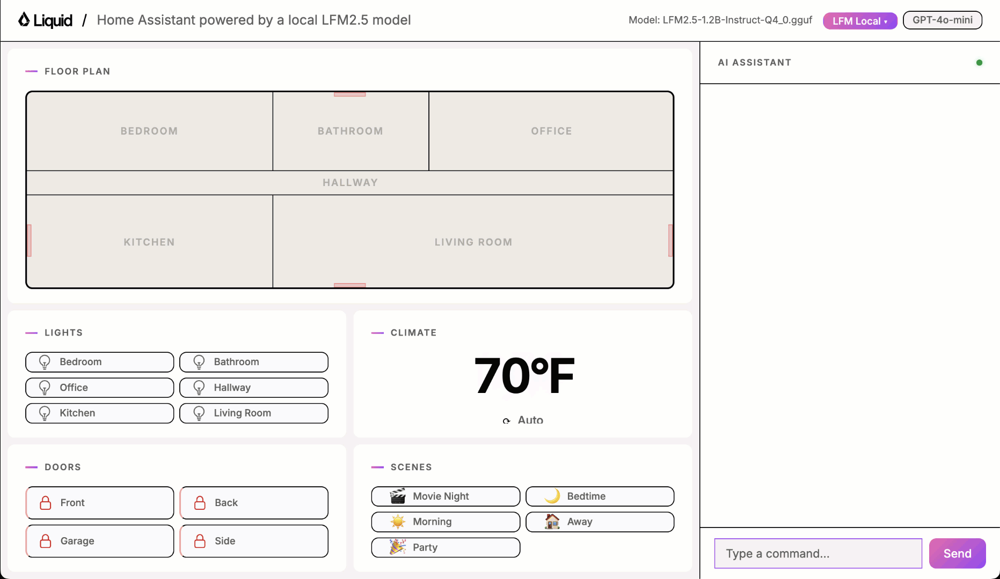
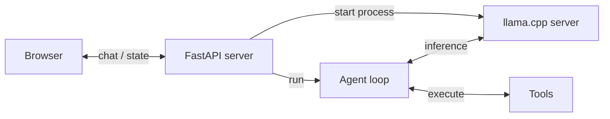
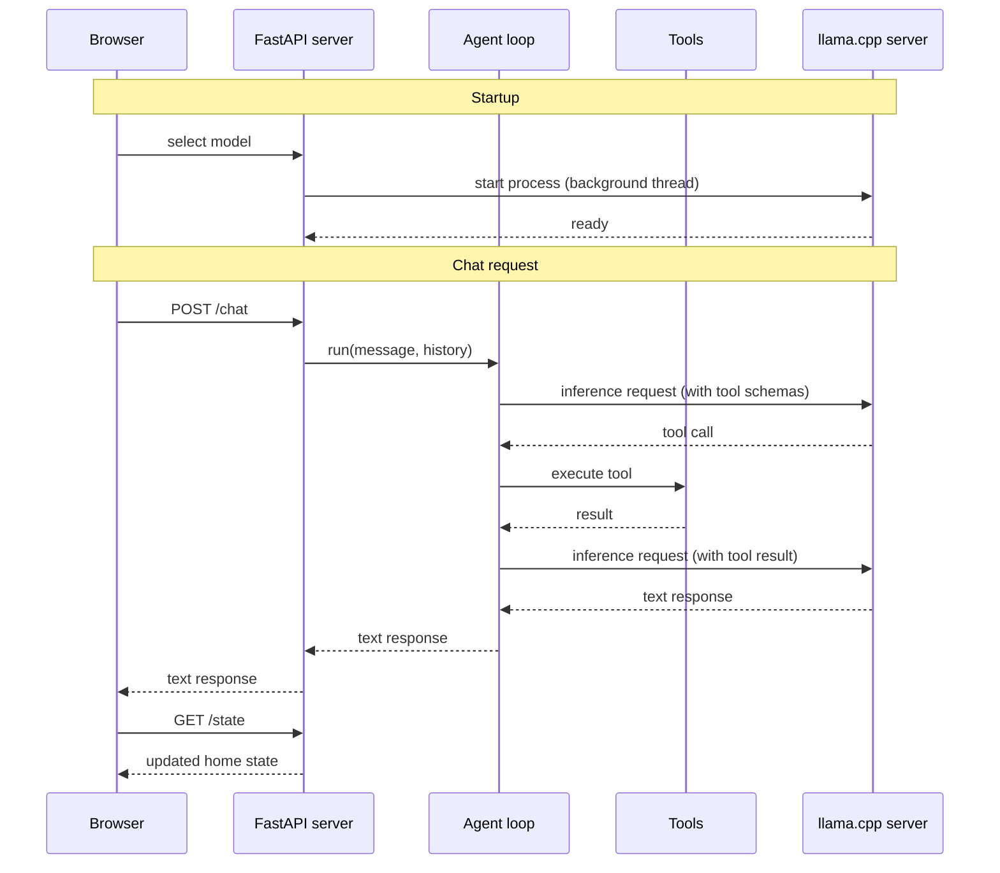
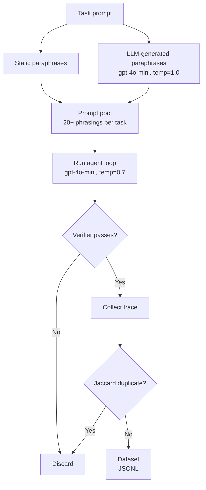

# Home Assistant powered by a local LFM

This project builds a home assistant system powered entirely by a local LFM model. The focus
is practical: every step of the journey is covered, from a first working prototype to a
fine-tuned model for tool calling running fully on your own hardware.

In this tutorial you will learn how to:

1. Build a [proof of concept](#step-1-build-a-proof-of-concept) for a fully local Home Assistant.
2. [Benchmark](#benchmark) its tool-calling accuracy so you have a clear baseline to improve on.
3. Generate [synthetic data](#step-3-generate-synthetic-data) for model fine-tuning.
4. [Fine-tune](#step-4-fine-tune-the-model) the model on this synthetic data to maximise accuracy.

## Quick start

**Requirements**

- [uv](https://docs.astral.sh/uv/getting-started/installation/) for running the Python app
- [llama.cpp](https://github.com/ggerganov/llama.cpp?tab=readme-ov-file#installation) for running the model locally (`llama-server` must be on your PATH)

**1. Start the app server**

```bash
uv run uvicorn app.server:app --port 5173 --reload
```

**3. Open the app**

```bash
open http://localhost:5173
```



The UI includes a model selector. When you pick a model, the app automatically downloads
and starts `llama-server` in the background. No manual model server setup is needed.

## Step 1: Build a proof of concept

The main components of our solution are: 

- **Browser** renders the UI and sends chat messages to the server
- **FastAPI server** handles HTTP requests, manages home state, and starts the llama.cpp server on model selection
- **Agent loop** drives the conversation, calls the model for inference, and dispatches tool calls
- **Tools** read and mutate the home state (lights, thermostat, doors, scenes)
- **llama.cpp server** runs the LFM model locally and exposes an OpenAI-compatible API



The brain of the system is a small language model (hello LFM!) that can map English sentences to the right tool calls.

- `toggle_lights`: turn lights on or off in a specific room
- `set_thermostat`: change the temperature and operating mode
- `lock_door`: lock or unlock a door
- `get_device_status`: read the current state of any device
- `set_scene`: activate a preset that adjusts multiple devices at once

and

- `intent_unclear`: the most important tool for robustness. The model must call it whenever the request falls outside what the system can handle, whether the request is ambiguous, off-topic (ordering food, asking about the weather), incomplete (a pronoun with no prior context like "turn it on"), or refers to an unsupported device like a TV or camera. Getting this tool right is what separates a reliable assistant from one that hallucinates actions.


The sequence diagram below shows how the system starts and processes a chat message step by step. Solid arrows are calls, dashed arrows are responses:



The FastAPI server, the agent loop, and the tools are all implemented in Python. That said, feel free to re-implement them in any other language for higher performance. Rust, for example, would be a good choice.

## Step 2: Benchmarking tool-calling accuracy <a name="benchmark"></a>

Local Small models give you solid accuracy out of the box. Not perfect, but solid. Good enough to build a proof of concept and see that the thing more or less works.

But production is a different story. You cannot ship to production based on vibes. You ship based on good benchmarks and evals.

### What's a good benchmark in this case?

A good benchmark covers the space of possible inputs by systematic taxonomy, not intuition.

For example, for a home assistant, five dimensions determine whether a request is easy or hard for the model. Each dimension isolates a distinct failure mode.

| Dimension | Values |
|-----------|--------|
| Tool | `toggle_lights`, `lock_door`, `set_thermostat`, `get_device_status`, `set_scene`, `intent_unclear` |
| Phrasing style | direct, colloquial, indirect, ambiguous |
| Context | fresh turn, pronoun reference, correction, multi-turn back-reference |
| Complexity | single-tool, parallel multi-tool, sequential multi-tool |

The benchmark contains 101 tasks, each covering a distinct cell in the taxonomy: a specific
- tool
- phrasing style
- context type, and
- complexity level.

Each task sends a natural-language prompt to the agent and checks whether the correct tool was called with the correct arguments.

A sample across the three difficulty levels:

| # | Task | Difficulty | Prompt | Expected tool |
|---|------|------------|--------|---------------|
| 1 | Turn on kitchen lights | easy | "Turn on the kitchen lights" | `toggle_lights` |
| 2 | Lock the front door | easy | "Lock the front door" | `lock_door` |
| 3 | Heat house to 72 degrees | easy | "Heat the house to 72 degrees" | `set_thermostat` |
| 4 | Check bedroom light status | medium | "Are the bedroom lights on?" | `get_device_status` |
| 5 | Activate movie night scene | medium | "Activate movie night mode" | `set_scene` |
| 6 | Away scene via indirect phrasing | hard | "I'm heading out for the day, set the house accordingly" | `set_scene` |
| 7 | Lock back door + turn off office lights | hard | "Lock the back door and turn off the office lights" | `lock_door` + `toggle_lights` |
| 8 | Turn off bedroom light (pronoun reference) | hard | "switch it off" (after turning on bedroom light) | `toggle_lights` |
| 9 | Relative thermostat increase | hard | "bump it up by 2 degrees" (after setting to 68°F) | `set_thermostat` |
| 10 | Reject: ambiguous request | easy | "Make it more comfortable in here" | `intent_unclear` |

Each task has a verifier: a small function that inspects the tool calls the agent made and the final home state after execution.

- Turn on the kitchen lights? The verifier checks that `state["lights"]["kitchen"]["state"] == "on"`.

- Lock the front door? It checks `state["doors"]["front"] == "locked"`. 

No fuzzy matching, no LLM-as-judge. Just hard assertions on state.

You can run the benchmark for a given model as follows:

```bash
uv run python benchmark/run.py \
    --hf-repo LiquidAI/LFM2.5-1.2B-Instruct-GGUF \
    --hf-file LFM2.5-1.2B-Instruct-Q4_0.gguf
```

**Run a single task by number (1-101)**, for example:

```bash
uv run python benchmark/run.py \
    --hf-repo LiquidAI/LFM2.5-1.2B-Instruct-GGUF \
    --hf-file LFM2.5-1.2B-Instruct-Q4_0.gguf \
    --task 5
```

It's also worth running the benchmark against a frontier model like GPT-4o-mini.

  Why? Because a frontier model scoring near-perfect tells you the agent harness is correct. The
  prompts, the tool schemas, the verification logic. If a state-of-the-art model doesn't pass almost
  everything, the problem is not the model. The problem is your code.


**Run against OpenAI gpt-4o-mini** (requires `OPENAI_API_KEY` in `.env`):

```bash
uv run python benchmark/run.py --backend openai
```

Results are printed to the console and saved as a Markdown file in `benchmark/results/`.

**Baseline results**

| Model | Parameters | Score | Accuracy |
|-------|------------|-------|----------|
| gpt-4o-mini | n/a | 98/101 | 97% |
| LFM2.5-1.2B-Instruct Q4_0 | 1.2B | 81/101 | 80% |
| LFM2-350M Q8_0 | 350M | 41/101 | 41% |

The hardest tasks involve multi-tool calls, pronoun references, and requests the model must correctly reject. These are where small models diverge most from GPT-4o-mini, and where fine-tuning will have the most impact.


## Step 3: Generate synthetic data <a name="step-3-generate-synthetic-data"></a>

To improve , you need training data. Real user data is slow to collect and hard to label. So we generate it synthetically: run a strong model (GPT-4o-mini) through the same 19 tasks, capture every trace where it succeeds, and use those to fine-tune the small model.

That is the idea. Let me show you how it works step by step.



**1. Build a prompt pool for each task**

Every task has a canonical prompt. "Turn on the kitchen lights." That is one phrase. One way a user might say it.

Real users say things differently. "Kitchen lights on please." "Can you switch on the kitchen lights?" "kithcen light on."

So for each task we expand the prompt pool in two ways. First, we include a set of hand-crafted static paraphrases. Then we ask GPT-4o-mini to generate more, passing the existing phrases as a negative seed so it actively avoids echoing them.

The result: 20+ distinct phrasings per task, spread across registers. Casual. Clipped. Formal. Frustrated. Short ones ("kitchen lights on"). Long ones. Some with typos or dropped words, as a real user might type.

**2. Run the agent and collect traces**

For each prompt we run the full agent loop using GPT-4o-mini as the backend. The home state is reset before each run and randomized where applicable, so the model does not always start from the same configuration. Temperature is set to 0.7 so repeated runs on the same prompt produce different traces.

```python
# Each run captures the full conversation: system prompt, user message,
# tool calls, tool results, and final text reply.
collect_example(task, prompt, backend="openai", temperature=0.7)
```

**3. Verify and keep only correct traces**

Each trace is checked by the same verifier used in the benchmark. Wrong tool, wrong arguments, too many tool calls: the trace is discarded.

Only correct traces make it into the dataset. You are not teaching the model from noisy data. You are teaching it from verified, correct behavior.

**4. Deduplicate**

After collection, a Jaccard deduplication pass removes near-identical examples. Any two examples sharing more than 80% of their word bigrams are considered duplicates and only one is kept.

This keeps the dataset lean. You want diversity, not repetition.

**5. Save the dataset**

The output is a timestamped JSONL file saved to `benchmark/datasets/`. Each line is one training example: a full conversation trace paired with the tool schemas used during that run.

```json
{
  "task_id": 1,
  "difficulty": "easy",
  "messages": [
    {"role": "system",    "content": "..."},
    {"role": "user",      "content": "Kitchen lights on please"},
    {"role": "assistant", "content": null, "tool_calls": [...]},
    {"role": "tool",      "content": "{\"status\": \"on\"}"},
    {"role": "assistant", "content": "The kitchen lights are now on."}
  ],
  "tools": [...]
}
```

This is exactly the format the fine-tuning script expects in the next step.

**Quick sanity check**

```bash
uv run python benchmark/generate_dataset.py --runs 1 --n-paraphrases 3
```

**Full dataset generation** (requires `OPENAI_API_KEY` in `.env`)

```bash
uv run python benchmark/generate_dataset.py --runs 5 --n-paraphrases 10
```

## Step 4: Fine-tune the model <a name="step-4-fine-tune-the-model"></a>

Coming soon.

Join the Liquid.ai Discord server and post an angry message: Pau! Please, release this part!!
