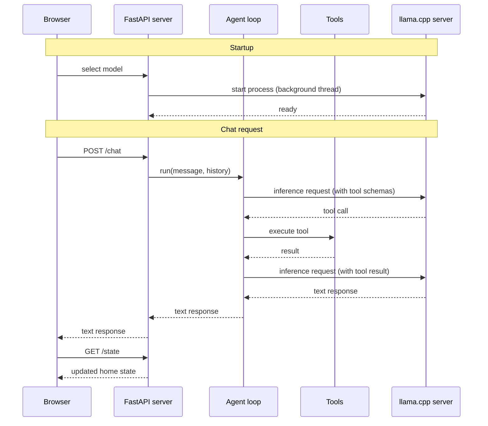

# Home Assistant powered by a local LFM model

This project builds a home assistant system powered entirely by a local LFM model. The focus
is practical: every step of the journey is covered, from a first working prototype to a
fine-tuned model running fully on your own hardware.

This tutorial is about one thing: tool calling with small language models running locally. Tool calling is the capability that lets a model interact with the real world by invoking functions, and it is the core skill any practical AI assistant needs. Here we show you how to build a real solution around it, from scratch, without relying on any cloud API.

You will learn how to:

1. Build a proof of concept that accepts plain-text commands to control lights, doors, the thermostat, and preset scenes.
2. Benchmark its tool-calling accuracy so you have a clear baseline to improve on.
3. Prepare a high-quality dataset for fine-tuning using synthetic data generation.
4. Fine-tune the model yourself and measure the improvement.


## Table of Contents

- [Architecture](#architecture)
- [Quick start](#quick-start)
- [Building a proof of concept](#proof-of-concept)
- [Benchmarking its tool-calling accuracy](#benchmark)
- [Preparing a high-quality dataset](#synthetic-data-generation)
- [Fine-tuning the model](#fine-tuning)

## Architecture

The main components of our solution are:

- **Browser** renders the UI and sends chat messages to the server
- **FastAPI server** handles HTTP requests, manages home state, and starts the llama.cpp server on model selection
- **Agent loop** drives the conversation, calls the model for inference, and dispatches tool calls
- **Tools** read and mutate the home state (lights, thermostat, doors, scenes)
- **llama.cpp server** runs the LFM model locally and exposes an OpenAI-compatible API

The sequence diagram below shows how the system starts and processes a chat message step by step. Solid arrows are calls, dashed arrows are responses:



The FastAPI server, the agent loop, and the tools are all implemented in Python. That said, feel free to re-implement them in any other language for higher performance. Rust, for example, would be a natural fit.


## Quick start

**1. Install dependencies**

```bash
uv sync
```

**2. Start the app server**

```bash
uv run uvicorn app.server:app --port 5173 --reload
```

**3. Open the app**

```bash
open http://localhost:5173
```

The UI includes a model selector. When you pick a model, the app automatically downloads
and starts `llama-server` in the background. No manual model server setup is needed.

## Proof of concept

## Synthetic data generation

`benchmark/generate_dataset.py` generates a golden SFT dataset by running a capable
model (GPT-4o-mini by default) on each task, verifying the output programmatically,
and saving only the passing traces.

### What a training example looks like

Each saved example is one correct conversation trace in OpenAI message format:

```
system
user
assistant [tool_calls]
tool      [results]
assistant [text summary]
```

Serialized as JSONL with keys `messages`, `tools`, `task_id`, `difficulty`. The full
tool schema is stored alongside each example so fine-tuning frameworks can see exactly
which tools were available when the model made its decisions.

### Step-by-step pipeline

For each task and each prompt variant, the pipeline:

1. Resets `home_state` to the default clean state
2. Randomizes lights and doors for eligible tasks (see below)
3. Captures a snapshot of `initial_state` before the agent runs
4. Runs the agent, recording every `(tool_name, args)` call and the full message trace
5. Checks the final `home_state` with the task verifier
6. Applies call-quality filters (enum validation, max-calls limit)
7. Saves the trace if and only if both checks pass

Steps 5 and 6 require no LLM calls. All verification is programmatic and runs in O(1).

### State diversity: randomized initial conditions

A critical flaw in naive dataset generation is starting every trace from the same
initial state. If every trace starts with all lights off and all doors locked, the
model learns to answer "turn on the kitchen lights" for a house that always starts
dark. In production the house may already have lights on, doors unlocked, and a
thermostat at an unexpected setting.

The generator calls `randomize_state()` before each agent run for tasks that do not
depend on a fixed starting condition (tasks 1-11 and 13). This randomly sets each
light to on/off and each door to locked/unlocked. The task verifier still checks the
correct final state, so any trace where the agent fails to reach it is discarded. The
result is a dataset where the same request appears against many different starting
conditions.

Tasks 12, 14, and 15 are kept deterministic because their conversation histories
explicitly reference a prior state (e.g., "set the thermostat to 68 degrees"). The
agent must use that history to act correctly, and randomizing the underlying state
would contradict the conversation context.

The task 14 verifier was also updated to use `initial_state["thermostat"]["temperature"] + 2`
instead of a hardcoded target of 70. This makes it robust to any future thermostat
randomization and ensures the dataset teaches the general arithmetic, not a memorized
constant.

### Paraphrase diversity: template-based generation

With only 3-4 hand-written phrasings per task, each running 20 times, the dataset
contains 20 near-identical examples per phrasing. The model learns the exact sentences
seen during training rather than the underlying intent.

Tasks 1-8 now use 10-11 template variants each, covering a range of styles:

| Style | Example (task 1) |
|---|---|
| Direct command | "Turn on the kitchen lights" |
| Polite request | "Could you put the kitchen lights on?" |
| Noun-first | "Kitchen lights on please" |
| Implicit verb | "Kitchen light on" |
| Necessity framing | "I need the kitchen lights on" |

These are correct by construction. No LLM verification is needed beyond the standard
state check.

### History variants for multi-turn tasks

Tasks 12 and 15 rely on back-reference resolution across conversation turns. A naive
implementation uses the same history for every run, which causes the model to memorize
the specific pattern rather than learning the general skill.

**Task 12** ("switch it off") originally always had history `"switch on the bedroom light"`,
so "it" always resolved to bedroom. The generator now cycles through four history
variants where the light that was turned on is bedroom, office, kitchen, or hallway.
Each variant uses a verifier that checks the corresponding room is off.

**Task 15** ("unlock the first one") originally always had front door as the first door
mentioned. Three history variants now cover different door orderings (front/garage,
back/side, garage/front). The verifier for each variant checks the correct first door.

### `intent_unclear` rejection examples (tasks 16-19)

The `intent_unclear` tool exists in the schema but had zero training examples. A model
fine-tuned without any rejection examples will attempt to execute a guess rather than
flag an unclear request. Four new task categories provide negative training signal:

| Task | Prompt example | Expected reason |
|---|---|---|
| 16 | "Dim the living room lights to 50%" | `unsupported_device` |
| 17 | "Order a pizza for delivery" | `off_topic` |
| 18 | "Turn it on" (no prior context) | `incomplete` |
| 19 | "Make it more comfortable in here" | `ambiguous` |

Each has 7-8 paraphrase variants. Verification checks that `intent_unclear` was called
with the correct `reason` argument. No LLM grading needed.

### Call-quality filters

The state verifier confirms the correct outcome but says nothing about how the model
got there. A trace where the model calls `toggle_lights` six times to turn on one room
is technically passing but is a poor training example.

Two filters run after verification before a trace is saved:

**Enum validation.** Every argument in every tool call is checked against the schema's
allowed values. A call with `room="living room"` (space instead of underscore) or
`state="dim"` is rejected. These are hallucinated values that should never appear in
training data.

**Max-calls limit.** Each task has a ceiling on total tool calls based on its
complexity. Easy tasks allow up to 3 calls; hard multi-tool tasks allow up to 9.
Traces that exceed the limit are discarded as inefficient demonstrations.

### Dataset size

With the improvements above, a full run produces roughly:

| Source | Prompts | Runs | Expected examples |
|---|---|---|---|
| Tasks 1-8 (11 prompts each) | 88 | 20 | ~1,700 |
| Tasks 9-11, 13 (5 prompts each) | 20 | 20 | ~380 |
| Task 12 (5 prompts x 4 history variants) | 20 | 20 | ~380 |
| Task 14 (5 prompts) | 5 | 20 | ~95 |
| Task 15 (5 prompts x 3 history variants) | 15 | 20 | ~285 |
| Tasks 16-19 (7-8 prompts each) | 30 | 20 | ~570 |

Total: roughly 3,400 examples, compared to ~1,200 before. The pass rate for
rejection tasks (16-19) depends on whether GPT-4o-mini correctly calls
`intent_unclear` rather than attempting to execute the request. Expect 70-90%
pass rates for those tasks.

### Running the generator

```bash
# Full run (~3,400 examples, uses OpenAI)
uv run python benchmark/generate_dataset.py

# Quick sanity check (1 run per prompt)
uv run python benchmark/generate_dataset.py --runs 1

# Use the local model instead
uv run python benchmark/generate_dataset.py --backend local
```

Output is a timestamped JSONL file in `benchmark/datasets/`. Once a fine-tuned
model is available, it can be used as the generator backend, bootstrapping
data quality iteratively without OpenAI API costs.

---

## Fine-tuning

The `finetune/` directory contains two scripts for LoRA fine-tuning LFM2 on the
home-assistant SFT dataset via HuggingFace Jobs.

### Overview

| Script | Where it runs | Purpose |
|---|---|---|
| `finetune/push_to_hub.py` | local machine | Uploads the dataset JSONL to HF Hub |
| `finetune/train.py` | HF Jobs (remote GPU) | Runs Unsloth + TRL LoRA fine-tune |

The training script is submitted as a local file path. Only the dataset needs
to be on HF Hub so the remote job can call `load_dataset`.

The LoRA config mirrors the `unsloth-jobs/LFM2.5-1.2B-Instruct-mobile-actions`
fine-tune: rank 16, alpha 16, the same target modules, 3 epochs at lr=2e-4.

### Step 1: Install dependencies and log in

```bash
uv sync --group finetune

# Install the HF CLI if not already present
curl -LsSf https://hf.co/cli/install.sh | bash
huggingface-cli login   # paste a write-access HF token
```

### Step 2: Generate and upload the dataset

Run the dataset generator if you have not already (requires `OPENAI_API_KEY`):

```bash
uv run python benchmark/generate_dataset.py
```

Then push the latest JSONL to HF Hub (auto-detected from `benchmark/datasets/`):

```bash
uv run --group finetune finetune/push_to_hub.py
```

The repo name is derived from `HF_USERNAME` in `.env` (`HF_USERNAME/home-assistant-sft`).
Pass `--hub-repo` to override. The dataset is pushed as a private repo with a 90/10 train/test split.

### Step 3: Submit fine-tuning jobs

`hf jobs uv run` accepts a local file path directly. UV reads the inline
`# /// script` block at the top of `train.py` and installs all dependencies
on the remote machine automatically.

**LFM2.5-1.2B-Instruct** on an L4 GPU (~$1-2 total, ~60-90 min):

```bash
hf jobs uv run finetune/train.py \
    --flavor l4-x1 \
    --secrets HF_TOKEN \
    --timeout 4h \
    --dataset-repo USERNAME/home-assistant-sft \
    --model        LiquidAI/LFM2.5-1.2B-Instruct \
    --output-repo  USERNAME/LFM2.5-1.2B-home-assistant-sft
```

**LFM2-350M-Instruct** on a T4 GPU (~$0.20-0.40 total, ~20-30 min):

```bash
hf jobs uv run finetune/train.py \
    --flavor t4-small \
    --secrets HF_TOKEN \
    --timeout 2h \
    --dataset-repo USERNAME/home-assistant-sft \
    --model        LiquidAI/LFM2-350M-Instruct \
    --output-repo  USERNAME/LFM2-350M-home-assistant-sft
```

### Step 4: Benchmark the fine-tuned model

The fine-tuned model (LoRA adapters merged into the base weights) is pushed to
HF Hub automatically when the job completes.

To evaluate it locally:

1. Download the exported GGUF from the model repo on HF Hub.
2. Point `llama-server` at the new model:

```bash
llama-server \
  --hf-repo USERNAME/LFM2.5-1.2B-home-assistant-sft \
  --hf-file <model>.gguf \
  --port 8080 \
  --ctx-size 4096 \
  --n-gpu-layers 99
```

3. Run the benchmark as usual:

```bash
uv run python benchmark/run.py
```

The baseline score for LFM2.5-1.2B-Instruct is 73%. After fine-tuning on the
golden SFT dataset generated by GPT-4o-mini (which scores 100%), the score
should climb significantly.

---

## Agent design notes

Two patterns are essential when building multi-turn tool-calling apps with small models.

### 1. Maintain conversation history across requests

Each request must carry the full prior conversation, not just the current message. Without
it, the model has no context to resolve references like "it", "that room", or "the same
setting" and will guess incorrectly.

The server keeps a `conversation_history` list and prepends it to every `messages` array:

```python
# server.py
conversation_history: list[dict] = []

text = run_agent(req.message, history=conversation_history, on_tool_call=on_tool_call)
conversation_history.append({"role": "user",      "content": req.message})
conversation_history.append({"role": "assistant", "content": text})
```

Only plain `user`/`assistant` text turns are stored. Internal tool-call and tool-result
messages from the agent loop are not included.

### 2. Force a text response after tool execution with `tool_choice="none"`

Small models often re-issue the same tool call after receiving the result, instead of
generating a text confirmation. The agent loop detects this duplicate and breaks early.
A final API call with `tool_choice="none"` then forces the model to summarise what it
just did in plain text.

```python
# agent.py
if duplicate:
    break  # exit the tool loop cleanly

# forced text summary
final = client.chat.completions.create(
    model="local",
    messages=messages,
    tools=TOOL_SCHEMAS,
    tool_choice="none",
    temperature=0.1,
    max_tokens=256,
)
return final.choices[0].message.content or "Done."
```

Without this, the fallback is always an error string because a tool-call-only response
has `message.content = None`.
