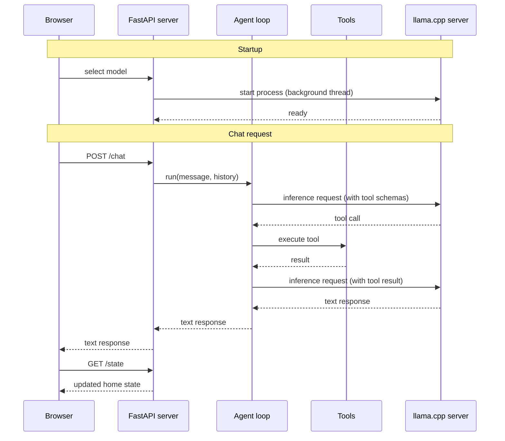

# Home Assistant powered by a local LFM model

This project builds a home assistant system powered entirely by a local LFM model. The focus
is practical: every step of the journey is covered, from a first working prototype to a
fine-tuned model running fully on your own hardware.

This tutorial is about one thing: tool calling with small language models running locally. Tool calling is the capability that lets a model interact with the real world by invoking functions, and it is the core skill any practical AI assistant needs. Here we show you how to build a real solution around it, from scratch, without relying on any cloud API.

You will learn how to:

1. Build a proof of concept that accepts plain-text commands to control lights, doors, the thermostat, and preset scenes.
2. Benchmark its tool-calling accuracy so you have a clear baseline to improve on.
3. Prepare a high-quality dataset for fine-tuning using synthetic data generation.
4. Fine-tune the model yourself and measure the improvement.


## Table of Contents

- [Quick start](#quick-start)
- [Step 1. Building a proof of concept](#step-1-proof-of-concept)
- [Step 2. Benchmarking its tool-calling accuracy](#benchmark)
- [Step 3. Preparing a high-quality dataset](#synthetic-data-generation)
- [Step 4. Fine-tuning the model](#fine-tuning)


## Quick start

**Requirements**

- [uv](https://docs.astral.sh/uv/getting-started/installation/) for running the Python app
- [llama.cpp](https://github.com/ggerganov/llama.cpp?tab=readme-ov-file#installation) for running the model locally (`llama-server` must be on your PATH)

**1. Start the app server**

```bash
uv run uvicorn app.server:app --port 5173 --reload
```

**3. Open the app**

```bash
open http://localhost:5173
```

The UI includes a model selector. When you pick a model, the app automatically downloads
and starts `llama-server` in the background. No manual model server setup is needed.

## Step 1: Proof of concept

The main components of our solution are:

- **Browser** renders the UI and sends chat messages to the server
- **FastAPI server** handles HTTP requests, manages home state, and starts the llama.cpp server on model selection
- **Agent loop** drives the conversation, calls the model for inference, and dispatches tool calls
- **Tools** read and mutate the home state (lights, thermostat, doors, scenes)
- **llama.cpp server** runs the LFM model locally and exposes an OpenAI-compatible API

The sequence diagram below shows how the system starts and processes a chat message step by step. Solid arrows are calls, dashed arrows are responses:



The FastAPI server, the agent loop, and the tools are all implemented in Python. That said, feel free to re-implement them in any other language for higher performance. Rust, for example, would be a natural fit.


### What about a real-world deployment?

This demo uses simplified stand-ins for every component except the AI reasoning layer. Here is what each one would become in a real deployment:

- **Browser** becomes a native mobile app (iOS/Android) or a dedicated dashboard like Home Assistant's Lovelace. Text input is replaced by a wake-word pipeline: a microphone, a keyword detector, and Whisper for speech-to-text.
- **FastAPI server** becomes an always-on hub running on dedicated hardware: a Raspberry Pi 5, a Home Assistant Yellow, or a small NUC. State is persisted in a database rather than an in-memory dict, and the process survives reboots.
- **Agent loop** stays conceptually the same, but runs as a persistent background service and is triggered by the wake-word pipeline instead of an HTTP POST.
- **Tools** go from Python functions that mutate a dict to real device integration drivers. `toggle_lights` becomes a call to the Philips Hue Bridge local REST API or a Zigbee command via a USB coordinator stick (e.g. ConBee II with Zigbee2MQTT). `set_thermostat` becomes a call to the Nest Device Access cloud API over OAuth 2.0. Newer devices use Matter, a vendor-neutral protocol where commands go directly over local IP to any commissioned device, with no cloud hop required.
- **llama.cpp server** moves from a developer laptop to dedicated edge hardware with an NPU or small discrete GPU (e.g. Jetson Orin), or a private self-hosted inference endpoint on the local network. A cloud API is avoided for privacy and latency reasons.

The focus of this example is on the tool calling capabilities of a small, highly specialised, fine-tuned language model.
Feel free to take this brain and plug it into a real deployment infrastructure.


