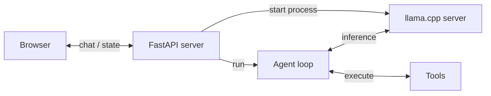
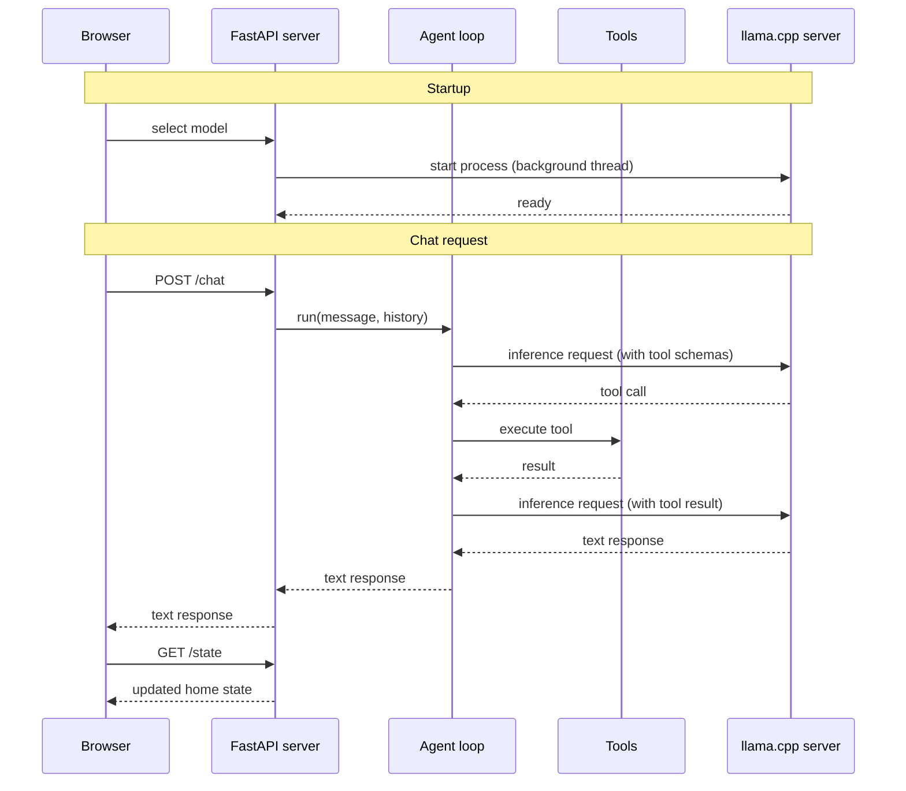

# Building a local Home Assistant with LFM

Today we kick off a hands-on series on running a small language model entirely on your own hardware to control a smart home.

No cloud API keys. No latency to a remote server. No data leaving your machine.

Just a local LFM model answering questions like "turn off the kitchen lights" or "lock the front door" and making it happen.

By the end of this series you will have:

1. A working proof of concept with a browser UI
2. A principled benchmark to measure tool-calling accuracy
3. A fine-tuned model that closes the gap with GPT-4o-mini

Today we cover **Parts 1 and 2**: building the prototype and measuring where we stand.

You can find all the source code in this open-source repository.
Give it a star on Github ⭐ if you get value from it

Let's go.

---

## Step 1: Build a proof of concept

The main components of our solution are: 

- **Browser** renders the UI and sends chat messages to the server
- **FastAPI server** handles HTTP requests, manages home state, and starts the llama.cpp server on model selection
- **Agent loop** drives the conversation, calls the model for inference, and dispatches tool calls
- **Tools** read and mutate the home state (lights, thermostat, doors, scenes)
- **llama.cpp server** runs the LFM model locally and exposes an OpenAI-compatible API



The brain of the system is a small language model (hello LFM!) that can map English sentences to the right tool calls.

- `toggle_lights`: turn lights on or off in a specific room
- `set_thermostat`: change the temperature and operating mode
- `lock_door`: lock or unlock a door
- `get_device_status`: read the current state of any device
- `set_scene`: activate a preset that adjusts multiple devices at once

and

- `intent_unclear`: the most important tool for robustness. The model must call it whenever the request falls outside what the system can handle, whether the request is ambiguous, off-topic (ordering food, asking about the weather), incomplete (a pronoun with no prior context like "turn it on"), or refers to an unsupported device like a TV or camera. Getting this tool right is what separates a reliable assistant from one that hallucinates actions.

### Writing the system prompt

With the tools defined, you need a system prompt that tells the model how to use them. Here is the one we use:

```python
SYSTEM_PROMPT = (
    "You are a home assistant AI. Use tools to control the home; respond in text when no tool is needed. "
    "Output function calls as JSON.\n"
    "Lights (on/off): bedroom, bathroom, office, hallway, kitchen, living_room.\n"
    "Doors (lock/unlock): front, back, garage, side.\n"
    "Thermostat: temperature 60-80°F, modes: heat, cool, auto.\n"
    "Scenes: movie_night, bedtime, morning, away, party.\n"
    "Call intent_unclear (never plain text) when the request is: "
    "ambiguous (could be satisfied by multiple different home control actions, e.g. 'make it nicer in here' could mean thermostat, lights, or a scene), "
    "off_topic (unrelated to home control), "
    "incomplete (no target device or room specified even after reading conversation history, e.g. 'turn it on' as the opening message), "
    "or unsupported_device (refers to a device or feature not available, e.g. brightness, TV, music)."
)
```

Every line earns its place. Here is why:

**"Output function calls as JSON."** LFM models default to Pythonic function call syntax. [The Liquid docs](https://docs.liquid.ai/lfm/key-concepts/tool-use) explicitly recommend adding this line to your system prompt when you want JSON-formatted tool calls instead. We want JSON because it composes cleanly with the OpenAI SDK's structured `tool_calls` objects.

**The device inventory** (lights, doors, thermostat ranges, scenes). The model cannot know your specific home setup from the tool schemas alone. Listing the exact valid values (rooms, door names, temperature bounds, scene names) gives the model the grounding it needs to fill arguments correctly without guessing.

**The `intent_unclear` rules.** This is the most important part of the prompt. A small model without explicit rejection rules will try to force-fit every ambiguous request into one of the action tools, hallucinating a room name or device. The four cases (ambiguous, off_topic, incomplete, unsupported_device) map precisely to the failure modes you will see in practice. Writing them out in plain English, with concrete examples for each, is what turns a brittle prototype into a robust assistant.

**Keep it short.** [Tool definitions consume context tokens](https://docs.liquid.ai/lfm/key-concepts/tool-use) because they are inserted as text into the model's context. The tighter your system prompt and tool schemas, the more room you leave for conversation history. Every word here is load-bearing; nothing is decorative.

The sequence diagram below shows how the system starts and processes a chat message step by step. Solid arrows are calls, dashed arrows are responses:



The FastAPI server, the agent loop, and the tools are all implemented in Python. That said, feel free to re-implement them in any other language for higher performance. Rust, for example, would be a good choice.

## Step 2: Benchmarking tool-calling accuracy <a name="benchmark"></a>

Play with the UI using one of the small local models and you will notice:

- sometimes it works

  

- sometimes it doesn't.

  


That's fine for a proof of concept. But the full power of small language models only comes out
  when you fine-tune them.

  Before you fine-tune, though, you need to know where you stand. You need to measure. You cannot ship to production based on vibes or things that more or less work. You ship based on good benchmarks and evals.


### What's a good benchmark?

A good benchmark covers the space of possible inputs by systematic taxonomy, not intuition. Here is the methodology we use here to build `benchmark/`, a 100-task suite designed from the ground up around these principles.

**1. Start with a taxonomy**

Define the input space BEFORE writing prompts. A taxonomy makes coverage gaps visible and prevents accidental clustering around the examples you happened to think of first.

Our taxonomy has three dimensions:

| Dimension | Values |
|-----------|--------|
| Capability | `lights`, `thermostat`, `doors`, `status`, `scene`, `rejection`, `multi_tool` |
| Phrasing | `imperative`, `colloquial`, `implicit`, `question` |
| Inference depth | `literal` (words map 1:1 to tool + args), `semantic` (requires translation), `boundary` (model must reject) |

**2. Sample from every cell**

The Cartesian product of those dimensions defines the universe of task types. Sample at least one task per non-empty cell. This forces you to write prompts you would not have thought of otherwise, such as 
- an implicit-semantic thermostat request ("It feels like a sauna in here") or
- a boundary-case door request ("Is the house secure right now?").

**3. Write programmatic verifiers**

Every task has a pure Python verifier that inspects

- the final `home_state` dict, or
- captured `tool_calls` for read-only and rejection tasks.

No LLM-as-judge. Deterministic, fast, cheap.

```python
# State check: was the right final state reached?
passed = state["lights"]["kitchen"]["state"] == "on"

# Tool-call check (for status queries and rejections): was the right tool called with the right args?
call = _find_last_call(tool_calls, "intent_unclear")
passed = call is not None and call["args"].get("reason") == "off_topic"
```

### Let's run the benchmark

You can run the benchmark for a given model as follows:

```bash
uv run python benchmark/run.py \
    --hf-repo LiquidAI/LFM2.5-1.2B-Instruct-GGUF \
    --hf-file LFM2.5-1.2B-Instruct-Q4_0.gguf
```

**Run a single task by number (1-101)**, for example:

```bash
uv run python benchmark/run.py \
    --hf-repo LiquidAI/LFM2.5-1.2B-Instruct-GGUF \
    --hf-file LFM2.5-1.2B-Instruct-Q4_0.gguf \
    --task 5
```

It's also worth running the benchmark against a frontier model like GPT-4o-mini.

  Why? Because a frontier model scoring near-perfect tells you the agent harness is correct. The
  prompts, the tool schemas, the verification logic. If a state-of-the-art model doesn't pass almost
  everything, the problem is not the model. The problem is your code.


**Run against OpenAI gpt-4o-mini** (requires `OPENAI_API_KEY` in `.env`):

```bash
uv run python benchmark/run.py --backend openai
```

Results are printed to the console and saved as a Markdown file in `benchmark/results/`.

**Evaluatiom results**

| Model | Parameters | Score | Accuracy |
|-------|------------|-------|----------|
| gpt-4o-mini | n/a | 93/100 | 93% |
| LFM2.5-1.2B-Instruct Q4_0 | 1.2B | 71/100 | 71% |
| LFM2-350M Q8_0 | 350M | 28/100 | 28% |

These are not vibes anymore. These are actual numbers we can use to understand where we stand.

In the following sections, we will see how to improve the performance of our local LFM models to bridge the gap with gpt-4o-mini.


## What's next?

We have a working prototype and a clear baseline.

The next steps are:

- **Part 3**: Generate a synthetic SFT dataset from GPT-4o-mini's correct traces
- **Part 4**: Fine-tune LFM2.5-1.2B on that dataset and re-run the benchmark

The goal is to close the gap with GPT-4o-mini while running entirely on local hardware.

Let's keep building,

Pau

---

## Before you leave: upcoming hackathon

Liquid AI and DPhi Space are running a global online hackathon exploring what happens when AI meets satellite intelligence.

Starting April 13th, running for a month, fully online, open to participants around the world.

**What you'll build:** creative applications using satellite imagery, vision models, and space data to solve real-world challenges in Earth observation.

**Two tracks:**
- **Liquid Track:** Build with LFM2-VL or LFM2.5-VL. Fine-tuning on satellite data is encouraged. Prize: $5,000 cash + ~$15,000 in credits for software execution in space.
- **General AI Track:** Any AI approach, with preference for solutions designed around space-based compute realities (limited downlink, continuous data streams, on-board inference). Prize: ~$15,000 in credits for software execution in space.

Register here: [luma.com/n9cw58h0](https://luma.com/n9cw58h0)

Discord is where we'll keep all communication, updates, and coordination. See you there.
