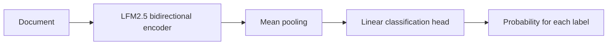

# Fine-tune LFM2.5-Encoder for document classification

[](https://discord.com/invite/liquid-ai)
[](https://x.com/liquidai)
[](https://www.linkedin.com/company/liquid-ai-inc/)

Fine-tune
[`LiquidAI/LFM2.5-Encoder-350M`](https://huggingface.co/LiquidAI/LFM2.5-Encoder-350M)
to classify long documents into one or more categories.

This example gives you a reusable pipeline for multi-label classification: point a YAML file at
your data, fine-tune the bidirectional encoder, tune decision thresholds on validation data, and
evaluate once on a held-out test split.

The included support-ticket dataset is deliberately tiny and synthetic. It verifies the pipeline;
replace it with your own data for a useful model.

## What you will build



The encoder reads the complete document bidirectionally. We remove its masked-token prediction
head, mean-pool the contextual token representations, and add one linear output per label. The
model returns every label score in one forward pass—there is no text generation or output parsing.

The tutorial has only two executable scripts:

```text
train.py    Fine-tune, validate, tune thresholds, and optionally evaluate test
predict.py  Classify one document with the saved model
```

## Quickstart

Run everything from this directory:

```bash
cd cookbook/examples/lfm-encoder-classification
uv sync
```

The model may require Hugging Face access. If necessary:

```bash
uv run hf auth login
```

Run a small end-to-end check:

```bash
uv run train.py --config config.yaml --smoke-test
```

The smoke test uses eight training examples, four validation examples, 128 tokens, and one epoch.
It checks the pipeline, but its quality metrics are not meaningful.

## 1. Prepare your data

Create training, validation, and test JSONL files. Each line needs a document and a list of labels:

```json
{"text":"The application fails when I upload a file.","labels":["technical"]}
{"text":"I was charged twice and my order has not shipped.","labels":["billing","shipping"]}
```

`text` may be a string or a list of paragraph strings. A document may have several labels—or an
empty list when none apply.

The repository includes tiny example files under [`sample_data/`](./sample_data/).

## 2. Configure the task

Edit [`config.yaml`](./config.yaml):

```yaml
model:
  id: LiquidAI/LFM2.5-Encoder-350M

dataset:
  source:
    type: json
    data_files:
      train: sample_data/train.jsonl
      validation: sample_data/validation.jsonl
      test: sample_data/test.jsonl
  text_column: text
  labels_column: labels
  labels: [account, billing, shipping, technical]

training:
  output_dir: local/classifier
  max_length: 512
  epochs: 3
  learning_rate: 2.0e-5
  precision: fp32
```

To use a Hugging Face dataset, change only the source:

```yaml
source:
  type: huggingface
  id: your-organization/your-dataset
  name: optional-dataset-configuration
```

## 3. Fine-tune

```bash
uv run train.py --config config.yaml
```

[`train.py`](./train.py) is organized as a readable, top-to-bottom tutorial:

1. Load and validate the YAML configuration and dataset.
2. Define multi-label metrics and validation-only threshold tuning.
3. Replace the masked-language-model head with mean pooling and a linear classifier.
4. Tokenize, fine-tune, select the best validation checkpoint, and save the result.

Training uses binary cross-entropy with logits. The best checkpoint is selected using validation
average precision, which does not depend on a decision threshold. After training, the script uses
validation predictions to compare a fixed `0.5` threshold, one tuned global threshold, and tuned
per-label thresholds.

The output is saved under `local/classifier/` and includes the model, tokenizer, validation metrics,
and selected thresholds. `local/` is excluded from Git.

## 4. Evaluate on test

Do not use test metrics to choose hyperparameters or thresholds. Once the training configuration is
final, train it and evaluate test once:

```bash
uv run train.py --config config.yaml --evaluate-test
```

The script restores the best validation checkpoint, applies the thresholds selected on validation,
and writes `local/classifier/test_results.json`.

## 5. Classify a document

```bash
uv run predict.py \
  --config config.yaml \
  --text "My payment was accepted, but the order has not shipped."
```

You can also pass a text file:

```bash
uv run predict.py --config config.yaml --file path/to/document.txt
```

The result contains the selected labels and the probability assigned to every label.

## Long documents and GPU memory

Start at 512 or 2,048 tokens before increasing the context length. For 8,192-token full fine-tuning
on a CUDA GPU with bf16 support:

```yaml
training:
  max_length: 8192
  precision: bf16
  gradient_checkpointing: true
```

Gradient checkpointing reduces activation memory but makes training slower. The compact encoder may
run locally at inference time, while full long-context fine-tuning can still require a high-memory
GPU.

## Metrics

The tutorial reports micro and macro precision, recall, F1, average precision, exact-match accuracy,
hamming loss, and per-label metrics. Micro metrics summarize all decisions; macro and per-label
metrics expose poor performance on rare categories.

As a reference, this workflow reached **0.7913 test micro-F1** and **0.8400 test micro average
precision** on the public LexGLUE ECtHR Task A dataset using an 8,192-token context. This was a
single-seed proof of concept; no legal documents or trained checkpoints are included here.

## Optional: keep the model download local

For an offline training environment, download the base model once and point the configuration at it:

```bash
uv run hf download LiquidAI/LFM2.5-Encoder-350M --local-dir local/base-model
```

```yaml
model:
  id: LiquidAI/LFM2.5-Encoder-350M
  local_path: local/base-model
```

## Development

```bash
make test
make lint
make format
```

## Need help?

Join the [Liquid AI Discord Community](https://discord.com/invite/liquid-ai) and ask.
