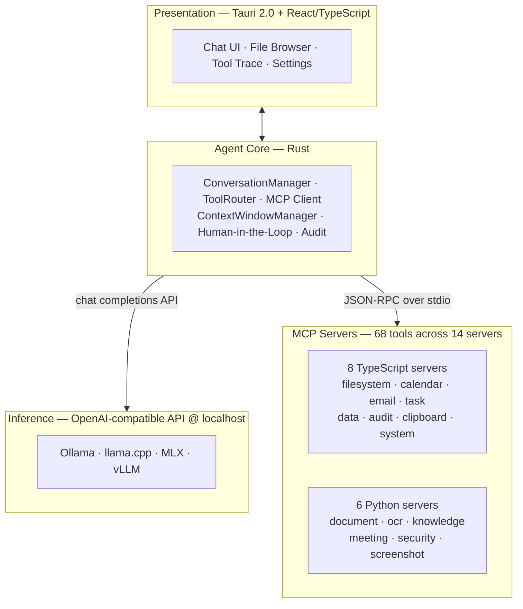

# LocalCowork

A desktop AI agent that runs **entirely on-device**. No cloud APIs, no data leaving your machine. LocalCowork delivers a Claude Cowork-style experience powered by a locally-hosted LLM that calls pre-built tools via the Model Context Protocol (MCP).

## Why LocalCowork?

Most AI assistants send your files, conversations, and documents to remote servers. LocalCowork keeps everything local — your contracts, receipts, meeting recordings, and personal data never leave your device. The model runs on your hardware, the tools operate on your filesystem, and the audit log lives in a local SQLite database.

## Architecture



The agent core communicates with the inference layer exclusively via the OpenAI chat completions API. Changing the model is a config change, not a code change.

## MCP Servers (13 total, 68 tools)

The model never writes code. It calls pre-built, sandboxed tools through MCP servers:

| Server | Language | Tools | Purpose |
|--------|----------|-------|---------|
| **filesystem** | TypeScript | 9 | File CRUD, search, watch (sandboxed) |
| **document** | Python | 8 | Extraction, conversion, diff, PDF generation |
| **ocr** | Python | 4 | Text extraction (LFM Vision primary, Tesseract fallback) |
| **knowledge** | Python | 5 | SQLite-vec RAG pipeline, semantic search |
| **meeting** | Python | 4 | Whisper.cpp transcription + diarization |
| **security** | Python | 7 | PII/secrets scanning + encryption |
| **calendar** | TypeScript | 4 | .ics parsing + system calendar API |
| **email** | TypeScript | 5 | MBOX/Maildir parsing + SMTP |
| **task** | TypeScript | 5 | Local SQLite task database |
| **data** | TypeScript | 5 | CSV + SQLite operations |
| **audit** | TypeScript | 4 | Audit log reader + compliance reports |
| **clipboard** | TypeScript | 3 | OS clipboard (Tauri bridge) |
| **system** | TypeScript | 5 | OS APIs — notifications, open, screenshots |

## Use Cases

LocalCowork ships with ten validated use cases that compose multiple tools:

| UC | Name | Key Servers |
|----|------|-------------|
| UC-1 | Receipt Reconciliation | filesystem, ocr, data, document |
| UC-2 | Contract / NDA Copilot | filesystem, document, security |
| UC-3 | Security & Privacy Steward | security, filesystem, audit |
| UC-4 | Download Triage | filesystem, document, ocr, knowledge |
| UC-5 | Screenshot-to-Action | ocr, clipboard, system, task |
| UC-6 | Meeting-to-Execution Pipeline | meeting, task, email, calendar |
| UC-7 | Personal Operations OS | task, calendar, email, data |
| UC-8 | Portfolio / Deal Memo Analyst | document, data, knowledge |
| UC-9 | Local Codebase + Docs Navigator | filesystem, knowledge, document |
| UC-10 | Offline Compliance Pack Generator | audit, document, security |

Every tool execution follows the human-in-the-loop pattern: non-destructive actions execute immediately; mutable actions show a preview and require confirmation; destructive actions require explicit typed confirmation. All actions are logged to the audit trail.

## Models

| Model | Runtime | VRAM | Accuracy | Role |
|-------|---------|------|----------|------|
| **LFM2-24B-A2B** | llama.cpp | ~16 GB | **80%** | **Active — production model** |
| LFM2.5-VL-1.6B | llama.cpp | ~1.8 GB | — | Vision OCR engine ([download](https://huggingface.co/LiquidAI/LFM2.5-VL-1.6B-GGUF)) |
| GPT-OSS-20B | Ollama | ~14 GB | ~36% | Development proxy (optional) |
| Qwen3-30B-A3B (MoE) | Ollama | ~4 GB | ~36% | Lightweight fallback |

**LFM2-24B-A2B** is a Liquid AI hybrid MoE model (24B total, ~2B active per token). It scores **80% single-step tool accuracy** across all 67 tools — outperforming the 20B dense transformer by 44 percentage points. Served via llama.cpp. Download from [HuggingFace](https://huggingface.co/LiquidAI/LFM2-24B-A2B-Preview) (gated — request access).

All text models use a 32k token context window. Model configuration lives in `_models/config.yaml`. Model files (GGUF) are stored in `~/Projects/_models/` (override with `LOCALCOWORK_MODELS_DIR`).

## What We Learned: Small Model Tool-Calling

> **The era of "throw all tools at a big model" is over for on-device deployment.** Architecture, filtering, and infrastructure matter more than parameter count. A well-instrumented 2B-active model outperforms a naive 20B dense model by a wide margin.

We benchmarked 5 models (1.2B to 32B) against 67+ tools and found three interventions that actually work — each with measured impact:

| Intervention | Impact | Cost |
|---|---|---|
| **RAG pre-filter to K=15 tools** | 36% → 78% accuracy (+117%) | ~10ms per query |
| **LoRA fine-tuned router** | 78% → 84%, 100% at K=25 | $5, 6 min on H100 |
| **Dual-model orchestrator** | 100% on 1-2 step tasks, zero pathologies, 2.5x faster | 2 models, ~14.5 GB VRAM |

**Key findings:**

- **Architecture > parameter count.** LFM2-24B-A2B (2B active, hybrid MoE) scores 80% — outperforming a 20B dense transformer by 44pp
- **Every model fails at cross-server transitions** (e.g., filesystem → OCR). This is the universal barrier, not a model-specific deficiency
- **Decomposition beats scale.** A dual-model orchestrator (plan → execute → synthesize) eliminates 5 behavioral pathologies and delivers clean execution on 1-2 step workflows
- **24B models are good dispatchers, not autonomous agents.** Design UX around single-turn tool calls with human confirmation — that turns 80% accuracy into near-100% effective accuracy

The full benchmark study — 5 models, 150+ scenarios, 12 failure modes, and a production orchestrator — is in [`docs/model-analysis/`](docs/model-analysis/). If you're building a local AI agent with tool calling, start with [Getting Maximum Leverage](docs/model-analysis/README.md#getting-maximum-leverage-from-24b-class-models).

## Prerequisites

| Requirement | Version | Purpose |
|-------------|---------|---------|
| **Node.js** | 20+ | TypeScript MCP servers, React frontend, Vite |
| **npm** | 10+ | Package management (comes with Node.js) |
| **Python** | 3.11+ | Python MCP servers (document, OCR, knowledge, meeting, security, screenshot) |
| **Rust** | 1.77+ | Tauri backend, Agent Core ([install via rustup](https://rustup.rs)) |
| **llama.cpp** | latest | Serves LFM2 models (`brew install llama.cpp` or [build from source](https://github.com/ggml-org/llama.cpp)) |
| **Tesseract** | 5.x | Fallback OCR engine (`brew install tesseract` / `apt install tesseract-ocr`) — optional |
| **Ollama** | latest | Alternative model runtime ([ollama.ai](https://ollama.ai)) — optional, for GPT-OSS-20B |

## Quick Start

```bash
# 1. Clone and enter the project
git clone <repo-url> && cd localCoWork

# 2. Run the automated setup (installs all deps, creates venvs, checks prereqs)
./scripts/setup-dev.sh

# 3. Download the LFM2-24B-A2B model (~14 GB, requires HuggingFace access)
#    Request access at: https://huggingface.co/LiquidAI/LFM2-24B-A2B-Preview
pip install huggingface-hub
python3 -c "
from huggingface_hub import hf_hub_download
hf_hub_download('LiquidAI/LFM2-24B-A2B-Preview',
                'LFM2-24B-A2B-Preview-Q4_K_M.gguf',
                local_dir='$HOME/Projects/_models/')
"

# 4. Start the model server (requires llama.cpp — brew install llama.cpp)
./scripts/start-model.sh

# 5. In another terminal — start the app
cargo tauri dev
```

### What Each Step Does

- **`setup-dev.sh`** — checks prerequisites, runs `cargo check`, installs npm workspaces, creates Python `.venv` for all 6 Python MCP servers, installs Tesseract, creates config dirs, installs git hooks.
- **`start-model.sh`** — starts llama-server for LFM2-24B-A2B on port 8080. Add `--vision` to also start the vision model on port 8081. Add `--check` to verify model files exist without starting servers.
- **`cargo tauri dev`** — launches the Tauri app (hot-reload frontend, Rust restarts on change). MCP servers start automatically.

### Alternative: Use Ollama Instead of LFM2

If you don't have access to LFM2-24B-A2B, you can use GPT-OSS-20B via Ollama as a development proxy (lower accuracy, but functional):

```bash
ollama pull gpt-oss:20b
ollama serve
# Then edit _models/config.yaml: set active_model to gpt-oss-20b
cargo tauri dev
```

### Optional: Vision OCR Model

For AI-powered OCR (better than Tesseract), download [LFM2.5-VL-1.6B](https://huggingface.co/LiquidAI/LFM2.5-VL-1.6B-GGUF) (~1.8 GB):

```bash
python3 -c "
from huggingface_hub import hf_hub_download
for f in ['LFM2.5-VL-1.6B-Q8_0.gguf', 'mmproj-LFM2.5-VL-1.6b-Q8_0.gguf']:
    hf_hub_download('LiquidAI/LFM2.5-VL-1.6B-GGUF', f, local_dir='$HOME/Projects/_models/')
"
# Start with: ./scripts/start-model.sh --vision
```

### Manual Setup (if you prefer not to use the script)

```bash
# Install TypeScript dependencies (root workspace + all 8 TS server workspaces)
npm install

# Create Python virtual environment and install Python servers
python3 -m venv .venv
source .venv/bin/activate
pip install pydantic pytest mypy ruff black
pip install -e mcp-servers/document
pip install -e mcp-servers/ocr
pip install -e mcp-servers/knowledge
pip install -e mcp-servers/meeting
pip install -e mcp-servers/security
pip install -e mcp-servers/screenshot-pipeline

# Verify Rust compiles
cd src-tauri && cargo check && cd ..

# Create local config directories
mkdir -p ~/.localcowork/{models,templates,trash}
```

## Running the App

```bash
# Development mode (hot-reload frontend, Rust restarts on change)
cargo tauri dev

# Production build (outputs a platform-native installer)
cargo tauri build
```

On first launch, the onboarding wizard guides you through hardware detection, model download, working directory selection, and MCP server configuration.

**MCP servers start automatically** — the Tauri backend spawns all configured MCP server processes at app startup using the definitions in `src-tauri/mcp-servers.json`. No manual server startup is needed.

### Vision OCR

The OCR server uses a two-tier engine priority:

1. **LFM Vision** (primary) — sends images to [LFM2.5-VL-1.6B](https://huggingface.co/LiquidAI/LFM2.5-VL-1.6B-GGUF) via the OpenAI-compatible API. Only 1.6B params (~1.8 GB with mmproj), runs on CPU. Strong OCR and document comprehension from Liquid AI. Served via llama.cpp (`llama-server --port 8081 --mmproj mmproj-*.gguf`).
2. **Tesseract** (fallback) — traditional OCR engine. No GPU needed, good for pure text documents. Requires `tesseract` binary installed.

The engine used is shown in tool traces (`engine: lfm_vision` or `engine: tesseract`) so you can verify which path is active. The Rust backend auto-detects vision-capable models from `_models/config.yaml` and injects the endpoint into MCP server processes.

## Running Tests

LocalCowork has **853 tests** across multiple tiers. All tests run without a local model unless noted.

### 1. Unit Tests (per MCP server)

Each server has colocated tests that validate the tool input/output contract.

**TypeScript servers** (8 servers):

```bash
# Run all TS server tests at once
npm test

# Or run individual servers
cd mcp-servers/filesystem && npm test     # 24 tests — file CRUD, search, watch
cd mcp-servers/data && npm test           # 27 tests — CSV, SQLite, dedup, anomalies
cd mcp-servers/audit && npm test          # 15 tests — log reader, reports
cd mcp-servers/task && npm test           # 28 tests — CRUD, overdue, daily briefing
cd mcp-servers/calendar && npm test       # 29 tests — events, free slots, time blocks
cd mcp-servers/email && npm test          # 40 tests — drafts, search, threads
cd mcp-servers/clipboard && npm test      # 21 tests — get/set/history (mock bridge)
cd mcp-servers/system && npm test         # 32 tests — sysinfo, processes, screenshots
```

**Python servers** (6 servers — activate the venv first):

```bash
source .venv/bin/activate

cd mcp-servers/document && pytest         # 25 tests — extraction, conversion, diff, PDF
cd mcp-servers/ocr && pytest              # 17 tests — image/PDF OCR, structured data
cd mcp-servers/knowledge && pytest        # 39 tests — indexing, search, RAG pipeline
cd mcp-servers/meeting && pytest          # 50 tests — transcription, action items, minutes
cd mcp-servers/security && pytest         # 57 tests — PII, secrets, encryption
cd mcp-servers/screenshot-pipeline && pytest  # 33 tests — capture, UI elements, actions
```

### 2. Integration Tests (UC-1 through UC-10)

End-to-end tests that compose multiple MCP tools in the same sequence as the PRD use cases. These call real tool `execute()` functions directly — **no model needed**.

```bash
# Run all 10 use case integration tests (50 tests)
npm run test:integration
```

| Test File | Use Case | Servers Tested |
|-----------|----------|----------------|
| `uc1_receipt_reconciliation.test.ts` | Receipt Reconciliation | filesystem, data |
| `uc2_contract_copilot.test.ts` | Contract Copilot | filesystem |
| `uc3_security_steward.test.ts` | Security Steward | filesystem |
| `uc4_download_triage.test.ts` | Download Triage | filesystem, data |
| `uc5_screenshot_to_action.test.ts` | Screenshot to Action | clipboard, data |
| `uc6_meeting_pipeline.test.ts` | Meeting Pipeline | task, calendar, email |
| `uc7_personal_ops.test.ts` | Personal Ops | task, calendar |
| `uc8_deal_memo.test.ts` | Deal Memo | filesystem, data, task |
| `uc9_codebase_navigator.test.ts` | Codebase Navigator | filesystem, clipboard |
| `uc10_compliance_pack.test.ts` | Compliance Pack | audit, filesystem |

### 3. Model Behavior Tests

Structural validation of 180 prompt-to-tool-call definitions. Tests pass without a model (validating test definitions are well-formed). When `LOCALCOWORK_MODEL_ENDPOINT` is set, they send real prompts to the model.

```bash
# Structural validation only (no model needed — 192 tests)
npm run test:model-behavior

# With a live model (requires Ollama serving gpt-oss:20b)
LOCALCOWORK_MODEL_ENDPOINT=http://localhost:11434/v1 npm run test:model-behavior
```

Breakdown: 100 tool-selection tests + 50 multi-step chain tests + 30 edge cases.

### 4. Model Swap Validation

Compares tool-calling accuracy between baseline (GPT-OSS-20B) and candidate (LFM2.5-24B) models.

```bash
# Structural validation (no model needed — 20 tests + 1 skipped)
npx vitest run tests/model-swap/

# Full swap comparison (requires both models available via Ollama)
LOCALCOWORK_MODEL_ENDPOINT=http://localhost:11434/v1 npx vitest run tests/model-swap/
```

Thresholds: tool selection must be within 5% of baseline, chain completion within 10%.

### 5. Cross-Platform Tests

Platform-aware smoke tests for filesystem behavior, build environment, and performance benchmarks.

```bash
# Run cross-platform tests (65 tests)
npx vitest run tests/cross-platform/
```

### 6. Smoke Tests

Fast regression checks that validate MCP server contracts against the PRD tool registry.

```bash
./scripts/smoke-test.sh                    # Full suite
./scripts/smoke-test.sh --contract         # Contract validation only
./scripts/smoke-test.sh --server filesystem  # Single server
```

### Run Everything

```bash
# All TypeScript tests (unit + integration + model-behavior + swap + cross-platform)
npm test \
  && npm run test:integration \
  && npm run test:model-behavior \
  && npx vitest run tests/model-swap/ \
  && npx vitest run tests/cross-platform/

# All Python tests (activate venv first)
source .venv/bin/activate
for server in document ocr knowledge meeting security screenshot-pipeline; do
  (cd "mcp-servers/$server" && pytest)
done

# Validate servers against PRD tool registry
./scripts/validate-mcp-servers.sh

# Rust checks
cd src-tauri && cargo check && cargo clippy -- -D warnings && cd ..
```

## Linting & Type Checking

All code must pass lint and type checks before commit.

```bash
# TypeScript
npx tsc --noEmit                                          # Type check
npx eslint src/ mcp-servers/*/src/ --ext .ts,.tsx          # Lint
npx prettier --check "src/**/*.{ts,tsx}"                   # Format check

# Python (activate venv first)
source .venv/bin/activate
ruff check mcp-servers/*/src/                              # Lint
mypy --strict mcp-servers/*/src/                           # Type check
black --line-length=100 --check mcp-servers/*/src/         # Format check

# Rust
cd src-tauri && cargo clippy -- -D warnings && cd ..       # Lint
```

## Project Structure

```
localCoWork/
├── src-tauri/src/              # Rust backend (Tauri 2.0)
│   ├── agent_core/             #   ConversationManager, ToolRouter, Audit
│   ├── mcp_client/             #   JSON-RPC stdio transport
│   ├── inference/              #   OpenAI-compat API client
│   └── commands/               #   Tauri IPC (chat, filesystem, hardware, settings)
├── src/                        # React + TypeScript frontend
│   ├── components/             #   Chat, FileBrowser, Onboarding, Settings
│   ├── stores/                 #   Zustand state (chat, fileBrowser, settings, onboarding)
│   ├── types/                  #   Shared TypeScript types
│   └── hooks/                  #   Custom React hooks
├── mcp-servers/                # All 14 MCP server implementations
│   ├── _shared/                #   Base classes (TS + Python)
│   ├── filesystem/             #   TypeScript — file CRUD, watch, search
│   ├── document/               #   Python — extraction, conversion, PDF
│   ├── ocr/                    #   Python — LFM Vision + Tesseract fallback
│   ├── knowledge/              #   Python — SQLite-vec RAG pipeline
│   ├── meeting/                #   Python — Whisper.cpp + diarization
│   ├── security/               #   Python — PII/secrets scan + encryption
│   ├── screenshot-pipeline/    #   Python — capture, OCR, action suggestion
│   ├── calendar/               #   TypeScript — SQLite calendar + time blocks
│   ├── email/                  #   TypeScript — drafts, search, threads
│   ├── task/                   #   TypeScript — local SQLite task DB
│   ├── data/                   #   TypeScript — CSV + SQLite operations
│   ├── audit/                  #   TypeScript — audit log + reports
│   ├── clipboard/              #   TypeScript — OS clipboard (Tauri bridge)
│   └── system/                 #   TypeScript — OS APIs (Tauri bridge)
├── tests/
│   ├── integration/            #   UC-1 through UC-10 end-to-end tests
│   ├── model-behavior/         #   180 prompt → tool test definitions
│   ├── model-swap/             #   GPT-OSS vs LFM2.5 comparison framework
│   ├── cross-platform/         #   macOS + Windows smoke tests + benchmarks
│   ├── helpers/                #   TestHarness, Python tool wrapper
│   └── fixtures/               #   Sample data for each UC
├── _models/                    # Local model registry (binaries gitignored)
├── _shared/services/           # Shared services (logger, config, state)
├── docs/                       # PRD, tool registry, ADRs, patterns
└── scripts/                    # setup-dev.sh, smoke-test.sh, validate-mcp-servers.sh
```

## Environment Variables

| Variable | Default | Purpose |
|----------|---------|---------|
| `LOCALCOWORK_MODEL_ENDPOINT` | `http://localhost:11434/v1` | OpenAI-compatible API endpoint for the local model |
| `LOCALCOWORK_MODELS_DIR` | `~/Projects/_models` | Directory for non-Ollama model files (GGUF, MLX) |
| `LOCALCOWORK_VISION_ENDPOINT` | (auto-detected) | Vision model API endpoint (injected from `_models/config.yaml`) |
| `LOCALCOWORK_VISION_MODEL` | (auto-detected) | Vision model name (e.g., `LFM2.5-VL-1.6B`) |
| `TAURI_DEBUG` | unset | Set to `1` for debug builds with sourcemaps |

## Code Standards

- **300 lines max** per file
- **Strict types** everywhere — `mypy --strict`, `tsc --noEmit` with strict mode, `cargo clippy`
- **No hardcoded config** — use `_shared/services/config_loader` and environment variables
- **Conventional commits** — `feat:`, `fix:`, `refactor:`, `docs:`, `test:`, `chore:`
- **80% test coverage** minimum (85% for shared services)
- **Structured JSON logging** via the shared Logger — no `print()` or `console.log()`

## Documentation

| Document | Purpose |
|----------|---------|
| `docs/PRD.md` | Full product requirements (source of truth) |
| `docs/mcp-tool-registry.yaml` | Machine-readable tool definitions for all 68 tools |
| `docs/architecture-decisions/` | ADRs for significant design choices |
| `docs/patterns/` | Implementation patterns (MCP server, error handling, HITL) |
| `PROGRESS.yaml` | Development progress checkpoint (session-to-session state) |
| `docs/model-analysis/` | Benchmark study: 5 models × 67 tools, failure taxonomy, architecture findings |
| `CLAUDE.md` | AI assistant guidance for working in this codebase |

## Known Limitations

LocalCowork is a working reference implementation, not a finished product. Current boundaries:

- **1-2 step workflows work reliably** via the dual-model orchestrator (100% tool selection, zero pathologies). **4+ step workflows are limited** — the planner under-decomposes complex tasks. See [Orchestrator Performance](docs/model-analysis/dual-model-orchestrator-performance.md).
- **Single-model mode completes ~26% of multi-step chains.** Single-step tool selection (80%) is reliable; chaining 3+ tools degrades due to conversation history. See the [benchmark data](docs/model-analysis/lfm2-24b-a2b-benchmark.md).
- **Batch operations process partial results** — the model may handle 1-2 items from a set of 10. Iteration prompting is a known gap.
- **Filename hallucination** — the model occasionally invents file paths instead of using exact results from prior tool calls.

These are documented transparently because they're instructive: they represent the current frontier of on-device tool-calling AI. The [failure taxonomy](docs/model-analysis/gpt-oss-20b.md) catalogs all 12 failure modes with evidence and workarounds.

## License

MIT
