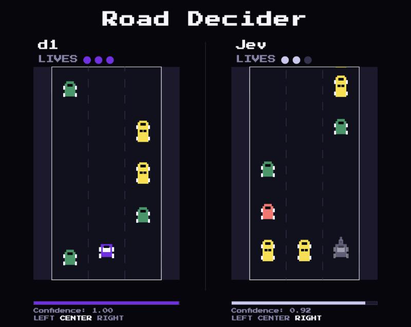

# Making real-time decisions with d1

[](https://discord.com/invite/liquid-ai)

This example shows how to use Liquid's [decision model](https://docs.liquid.ai/lfm/models/decision-models) to make structured choices in real time. The demo is a pixel-art survival racer where an AI decides which lane to drive in, hundreds of times per race.



Two cars race side by side on identical roads that get faster over time. Each car has three lives, and hitting traffic costs one. There is no finish line: the road keeps accelerating until one car runs out of lives. Play **You vs d1** to race the AI yourself with arrow keys (Enter to start), or watch **Jev vs d1** to see two decision models compete head-to-head.

Decision models are purpose-built for classification, routing, and scoring. Instead of generating text token by token, they return a structured answer in a single call. This makes them fast enough to use inside a game loop, and cheap enough to call on every tick.

This tutorial walks through the four pieces you need to use a decision model in your own app: defining a question, building the state, calling the API, and interpreting the result.

> This example uses vanilla JavaScript. The [decision model documentation](https://docs.liquid.ai/lfm/models/decision-models) also has examples in Python, TypeScript, and cURL.


## Prerequisites

You need the following to run this example:

- Node.js 18+
- A Liquid API key

To get a Liquid API key:

1. Go to [console.liquid.ai](https://console.liquid.ai). If you don't have an account yet, register and join an organization.
2. Navigate to **Dashboard > API Keys**
3. Create a new key and copy it

Optionally, to enable the Jev vs d1 mode, you also need an [OpenRouter](https://openrouter.ai) API key.


## Quickstart

1. Clone the repository
    ```sh
    git clone https://github.com/Liquid4All/cookbook.git
    cd cookbook/examples/road-decider
    ```

2. Create a `.env` file with your API keys
    ```sh
    cp .env.example .env
    # Edit .env: add LIQUID_API_KEY, and optionally OPENROUTER_API_KEY
    ```

3. Install dependencies and start the dev server
    ```sh
    npm install
    npm run dev
    ```

4. Open `localhost` and start a race.

If a key is missing, the start screen tells you which one, and the modes that need it are disabled.


## Configuration

By default, d1 runs through the Liquid API and Jev runs through OpenRouter. Each racer has three settings in `.env`:

| Variable | Default | Description |
|---|---|---|
| `LIQUID_API_KEY` | | API key for d1. Required. |
| `LIQUID_MODEL_NAME` | `d1:free` | d1 model name. |
| `LIQUID_BASE_URL` | `https://api.liquid.ai` | API that serves d1: `https://api.liquid.ai` or `https://openrouter.ai`. |
| `OPENROUTER_API_KEY` | | OpenRouter API key. Required for Jev vs d1 mode. |
| `OPENROUTER_MODEL_NAME` | `typesafe/jev-1.13` | Jev model name. |
| `OPENROUTER_BASE_URL` | `https://openrouter.ai` | API that serves Jev. |

The proxy picks the right endpoint path for each base URL, so you only set the host. For example, to run d1 through OpenRouter:

```sh
LIQUID_API_KEY=your-openrouter-api-key
LIQUID_MODEL_NAME=your-openrouter-d1-model
LIQUID_BASE_URL=https://openrouter.ai
```

The default models, base URLs, and endpoint paths are defined in [`config.js`](config.js).


## Project structure

The project is organized into three folders that separate the AI integration, game mechanics, and rendering.

```
road-decider/
├── index.html              # HTML shell with canvas and overlays
├── main.js                 # Entry point, mode selection, screen flow
├── config.js               # Game constants, default models, and API endpoints
├── style.css               # Layout and typography
├── ai/
│   └── ai.js               # Decision question, state builder, API call
├── game/
│   ├── game.js             # Game loop, collision detection, AI tick scheduling
│   ├── car.js              # Car state: lanes, lives, crashes
│   ├── road.js             # Scrolling road, lane positions, obstacle spawning
│   └── items.js            # Traffic patterns with escape-path validation
├── ui/
│   ├── ui.js               # HUD (names, lives) and confidence bars
│   ├── sprites.js          # Pixel art for cars and traffic vehicles
│   └── input.js            # Keyboard handler (arrow keys, enter)
├── vite.config.js          # Dev server with API proxy
├── .env.example            # Template for API keys
└── package.json
```


## How to build a game with decision models

Every decision tick (~2-5 times per second, depending on game speed), the AI car goes through four steps. For a full API reference, see the [decision model documentation](https://docs.liquid.ai/lfm/models/decision-models).

### Decision primitives

Decision models support three question types. Each one maps to a different kind of structured answer.

| Primitive | What it returns | Example use case |
|-----------|----------------|------------------|
| **Noul** | A yes/no probability | "Is this email spam?" |
| **Choice** | One option from a named set, with a probability distribution | "Which lane is safest?" |
| **Score** | A position on an ordered scale | "Rate this review 1-5" |

This game uses **choice** to pick one of three lanes. Each decision returns the selected lane, probabilities across all lanes, and a `confidence` value that summarizes how clear-cut the answer is.


### Step 1: Define the question

A decision model needs a structured question. The question in [`ai/ai.js`](ai/ai.js) uses a **choice** with three named options:

```js
const QUESTION = {
  lane: {
    type: "choice",    // return one named option + probability distribution
    instructions:
      "Pick the safest lane. Row 1 is most urgent. Prefer the current lane when options are equally safe.",
    criteria: {        // the options the model picks from
      left: "Left lane",
      center: "Center lane",
      right: "Right lane",
    },
  },
};
```

The `type` tells the model what kind of answer to return. The `instructions` field guides the model's reasoning. The `criteria` object lists the available options.


### Step 2: Build the state

The model needs context to decide. The `buildState` function in [`ai/ai.js`](ai/ai.js) summarizes the road ahead as a short text block:

```js
export function buildState(car, road) {
  const currentLane = LANES[Math.round(car.laneIndex)];
  // scan the rows ahead for obstacles
  const lookAhead = road.getLookAhead(car.y, CONFIG.LOOK_AHEAD_ROWS);

  const laneSummaries = LANES.map((lane) => {
    const firstObstacle = lookAhead[lane].findIndex((item) => item !== null);
    if (firstObstacle === -1) return `${lane}: clear`;
    return `${lane}: obstacle at row ${firstObstacle + 1}`;
  });

  // combine into a single text block for the model
  return [
    `Current lane: ${currentLane}. Pick the lane with the most room ahead.`,
    "",
    ...laneSummaries,
  ].join("\n");
}
```

This produces a state string like:

```
Current lane: center. Pick the lane with the most room ahead.

left: obstacle at row 2
center: clear
right: obstacle at row 4
```

The format matters. In our tests, per-lane summaries with the distance to the first obstacle led to much more confident decisions than a raw grid of the road.


### Step 3: Call the decision API

The front end in [`ai/ai.js`](ai/ai.js) sends the request to a local proxy route, one per racer (`/api/decision/d1` or `/api/decision/jev`):

```js
fetch(`/api/decision/${racer}`, {
  method: "POST",
  headers: { "Content-Type": "application/json" },
  body: JSON.stringify({
    state,               // the text block from buildState()
    questions: QUESTION, // the structured question defined above
  }),
});
```

The Vite dev server in [`vite.config.js`](vite.config.js) looks up the racer's base URL, key, and model, then forwards the request with the `Authorization` header so the key stays server-side:

```js
// proxy handler in vite.config.js
const upstream = await fetch(racer.url, {   // Liquid API or OpenRouter endpoint
  method: "POST",
  headers: {
    Authorization: `Bearer ${racer.apiKey}`,
    "Content-Type": "application/json",
  },
  body: JSON.stringify({ ...body, model: racer.model }),
});
```

The request body is the same for both APIs. Only the URL, key, and model name change.


### Step 4: Interpret the response

The API returns a choice, probabilities across all options, and a `confidence` value:

```json
{
  "answers": {
    "lane": {
      "type": "choice",
      "choice": "center",
      "probabilities": { "left": 0.03, "center": 0.93, "right": 0.04 },
      "confidence": 0.93
    }
  }
}
```

The `normalizeDecision` function in [`ai/ai.js`](ai/ai.js) extracts the lane and confidence. Because the answer is always one of the options you defined, the check only guards against a malformed response:

```js
function normalizeDecision(data) {
  const answer = data?.answers?.lane;
  if (!LANES.includes(answer?.choice)) {
    throw new Error("Unexpected response from the decision API.");
  }

  return {
    lane: answer.choice,
    probabilities: answer.probabilities,
    confidence: answer.confidence,
  };
}
```

The game then applies the decision in [`game/car.js`](game/car.js) to move the car and track its average confidence:

```js
applyDecision(decision) {
  this.setLane(decision.lane);  // move to the chosen lane
  this.lastConfidence = Number.isFinite(decision.confidence) ? decision.confidence : 0;
  this.confidenceTotal += this.lastConfidence;  // running total for avg display
  this.decisionCount += 1;
}
```

The `confidence` value is shown live below each road so you can watch how certain the model is under pressure. If a request fails, the error is shown there instead.


## Need help?

Join the [Liquid AI Discord Community](https://discord.com/invite/liquid-ai) and ask.

[](https://discord.com/invite/liquid-ai)
