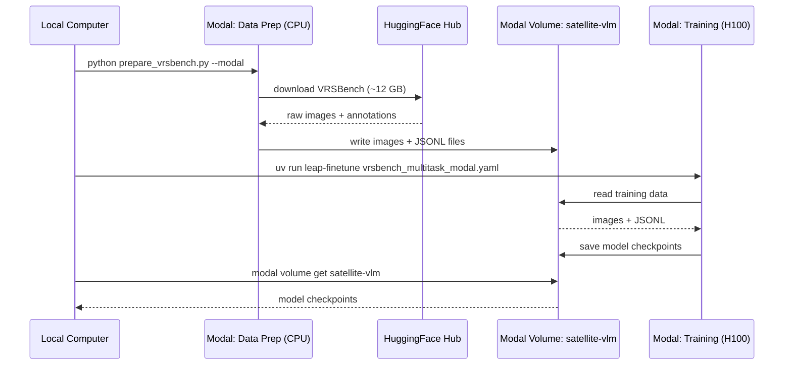

# Satellite Image VLM Fine-Tuning with VRSBench

Fine-tune [LiquidAI/lfm2.5-VL-450M](https://huggingface.co/LiquidAI/lfm2.5-VL-450M) on satellite imagery tasks using [leap-finetune](../../README.md) and the [VRSBench](https://huggingface.co/datasets/xiang709/VRSBench) dataset (NeurIPS 2024).

Supports three tasks:
- **VQA** -- Answer questions about satellite images (123K QA pairs)
- **Visual Grounding** -- Detect and localize objects with bounding boxes (52K references)
- **Captioning** -- Generate detailed descriptions of satellite scenes (29K captions)

## Quickstart

    # 1. Install leap-finetune
    cd /path/to/leap-finetune
    uv sync

    # 2. Download VRSBench and prepare data (~12 GB download)
    cd cookbook/satellite-vlm
    pip install huggingface_hub tqdm
    python prepare_vrsbench.py --task vqa

    # 3. Train
    cd ../..
    uv run leap-finetune cookbook/satellite-vlm/configs/vrsbench_vqa.yaml

## Preparing Data

The `prepare_vrsbench.py` script downloads VRSBench from HuggingFace and converts it to JSONL format compatible with leap-finetune.

    # Single task
    python prepare_vrsbench.py --task vqa
    python prepare_vrsbench.py --task grounding
    python prepare_vrsbench.py --task captioning

    # All tasks combined (multi-task)
    python prepare_vrsbench.py --task all

    # Quick test with limited samples
    python prepare_vrsbench.py --task vqa --limit 500

Output files are written to `./data/`:
- `vrsbench_{task}_train.jsonl` -- Training data
- `vrsbench_{task}_eval.jsonl` -- Evaluation data

## Training

Each task has a pre-configured YAML:

| Task | Config | Description |
|------|--------|-------------|
| VQA | `configs/vrsbench_vqa.yaml` | Visual question answering |
| Grounding | `configs/vrsbench_grounding.yaml` | Object detection with bounding boxes |
| Captioning | `configs/vrsbench_captioning.yaml` | Image description generation |
| Multi-task | `configs/vrsbench_multitask.yaml` | All three tasks combined |

    uv run leap-finetune cookbook/satellite-vlm/configs/vrsbench_vqa.yaml

To enable experiment tracking, uncomment the `tracker` lines in the YAML config.

## Running on Modal (no local GPU required)

[Modal](https://modal.com) provides serverless GPUs you pay for per second. New accounts include $30 of free credit, which is enough to run this fine-tuning end to end.

**One-time setup:**

    pip install modal
    modal setup            # authenticate with Modal
    huggingface-cli login  # needed for model downloads during training

**Step 1: prepare data on Modal (~12 GB, runs entirely in the cloud):**

    python prepare_vrsbench.py --task all --modal

This downloads VRSBench and converts it inside a Modal container, writing everything to a Modal Volume named `satellite-vlm`. No large files touch your local machine.

**Step 2: fine-tune on Modal:**

    uv run leap-finetune cookbook/examples/satellite-vlm/configs/vrsbench_multitask_modal.yaml

The training job runs on an H100, streams logs to your terminal, and saves checkpoints to the same `satellite-vlm` volume under `/satellite-vlm/outputs/`.

**Step 3: retrieve checkpoints:**

    modal volume ls satellite-vlm outputs/
    modal volume get satellite-vlm /satellite-vlm/outputs/<run-name> ./outputs

## Data Format

The grounding task uses JSON bounding box format with 0-1 normalized coordinates, matching the LFM VLM's pretraining format:

    User:      Inspect the image and detect the large white ship.
               Provide result as a valid JSON:
               [{"label": str, "bbox": [x1,y1,x2,y2]}, ...].
               Coordinates must be normalized to 0-1.

    Assistant: [{"label": "ship", "bbox": [0.37, 0.00, 0.80, 0.99]}]

VQA and captioning use standard question-answer format with no special structure.

## Evaluation

Benchmarks run automatically during training at every `eval_steps`:

- **VQA**: `short_answer` metric (case-insensitive substring match)
- **Grounding**: `grounding_iou` metric (IoU@0.5 threshold)
- **Captioning**: `CIDEr` or `BLEU` metrics

Each eval dataset can be limited (e.g., 500 samples) via the `limit` field in the YAML config for faster iteration.

**Running a full standalone evaluation:** To evaluate on the complete dataset without retraining, remove the `limit` fields, set `eval_on_start: true`, and use a very small training subset (e.g., `limit: 20` under `dataset`). The model will run the full evaluation at step 0, log results to WandB, and terminate.
