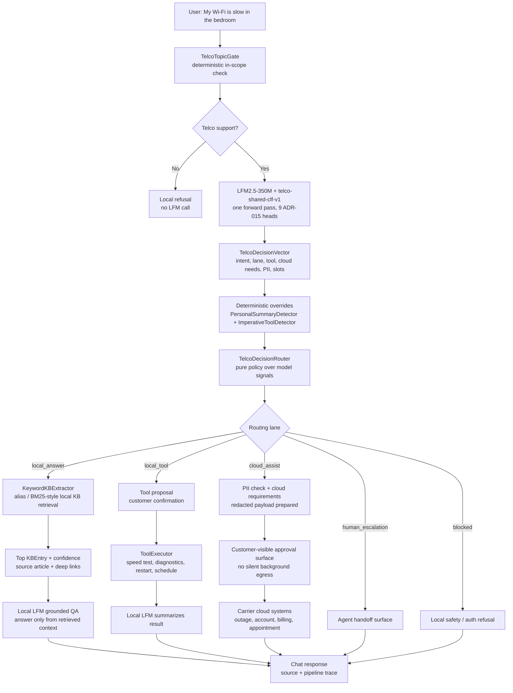

# Telco Triage iOS

Telco Triage is a SwiftUI reference app for a private, on-device home internet
support assistant powered by Liquid Foundation Models.

The app demonstrates an edge-first support architecture that is relevant to
carriers, banks, retailers, and any customer-facing mobile app with a long tail
of support requests:

1. A compact LFM runs in the iOS app.
2. A shared telco classifier adapter produces nine support decisions in one
   forward pass.
3. A deterministic router decides whether to answer locally, propose a local
   tool, use cloud assist, escalate to a human, or block.
4. Cloud assist receives only a redacted support bundle, and only when the
   workflow needs live account, billing, outage, or appointment systems.

This is a carrier-agnostic example. The Xcode project, scheme, app target,
source module, bundle ID, and visible app name are all generic Telco Triage
values.

## What This Shows

- Real LFM inference on device, not a scripted frontend.
- One resident LFM2.5-350M base model with LoRA adapters.
- Nine ADR-015 classifier heads for support routing, cloud requirements,
  escalation risk, PII risk, tool selection, transcript quality, and slot
  completeness.
- Local support tools such as restart router, speed test, diagnostics, WPS,
  extender reboot, and technician scheduling.
- A visible pipeline trace for model latency, confidence, route, and tool
  selection.
- Optional audio and vision pack scaffolding for voice support and visual
  troubleshooting.

The reference implementation is deliberately transparent. The model emits
typed signals, deterministic policy owns the final routing decision, and the UI
shows enough trace detail for developers and customers to inspect why a request
stayed local or moved toward cloud assist.

## Architecture



The model emits typed signals. The router owns the policy decision. This keeps
the agentic behavior auditable and testable.

For the slow-Wi-Fi prompt, the expected model signals are
`support_intent=troubleshooting` and either `routing_lane=local_answer`
or `routing_lane=local_tool`. The local RAG path uses `KeywordKBExtractor`
as the primary retriever because this KB has curated aliases; the LFM
then writes the final answer from the retrieved article. Cloud assist is
reserved for live outage/account/billing/appointment systems and is
represented in the demo as a redacted, customer-visible payload prepared
for integration.

## Model Artifacts

Large GGUF files are intentionally not committed to the cookbook repository.
The small classifier head files and metadata are committed under
`TelcoTriage/Resources/`.

The model architecture and distribution rationale are covered in
[MODELS.md](MODELS.md). In short: app source, sample data, manifests, and small
classifier heads belong in Git; full GGUF artifacts belong in a versioned model
registry or in a packaged demo build.

Required local GGUFs:

| File | Purpose |
| --- | --- |
| `lfm25-350m-base-Q4_K_M.gguf` | Resident LFM2.5-350M base model |
| `telco-shared-clf-v1.gguf` | Shared classifier LoRA for the nine telco heads |
| `telco-tool-selector-v3.gguf` | Tool argument and selection adapter |
| `chat-mode-router-v2.gguf` | Generative fallback router |
| `kb-extractor-v1.gguf` | Grounded KB answer adapter |

Optional transitional adapters:

- `chat-mode-clf-v1.gguf`
- `kb-extract-clf-v1.gguf`
- `tool-selector-clf-v1.gguf`

Put these files in `examples/telco-triage-ios/models/telco/`, or set
`TELCO_MODELS_DIR` to a directory containing them.

## Run Locally

Requirements:

- Xcode 15+
- iOS 17+ simulator or device
- `xcodegen`

Install XcodeGen if needed:

```bash
brew install xcodegen
```

Prepare and open the app:

```bash
cd examples/telco-triage-ios

# Option A: models live in ./models/telco
./bootstrap-models.sh

# Option B: models live elsewhere
TELCO_MODELS_DIR=/path/to/telco-models ./bootstrap-models.sh

xcodegen generate
open TelcoTriage.xcodeproj
```

Then run the `TelcoTriage` scheme. The display name on device is
`Telco Triage`.

## Validation

Fast non-LFM unit tests:

```bash
cd examples/telco-triage-ios
xcodegen generate
xcodebuild test \
  -project TelcoTriage.xcodeproj \
  -scheme TelcoTriage \
  -destination 'platform=iOS Simulator,name=iPhone 17 Pro' \
  -skip-testing:TelcoTriageTests/LFMValidationTests \
  -skip-testing:TelcoTriageTests/LlamaBackendSmokeTests
```

Full model smoke tests require the GGUFs to be copied with
`./bootstrap-models.sh`.

## Demo Prompts

Try these in the Chat tab:

```text
Restart my router
Run a speed test
My wifi is slow in the bedroom
What do the lights on my router mean?
Block my son's tablet from the internet
Is there an outage in my area?
Why is my bill higher this month?
I want to talk to a person
```

Engineering mode expands each response with the local model route, classifier
confidence, retrieval result, selected tool, latency, and cloud-assist posture.

## Extension Points

Telco Triage is designed to be adapted without changing the core inference
architecture:

| Area | Extension point |
| --- | --- |
| Knowledge | `TelcoTriage/Resources/knowledge-base.json` |
| Branding | `TelcoTriage/Core/Branding/` |
| Local actions | `TelcoTriage/Core/Tools/` and `ToolRegistry` |
| Routing taxonomy | ADR-015 classifier labels and deterministic router policy |
| Cloud assist | Redacted payload contract for live carrier systems |

## Notes

- Use the **Base** LFM2.5-350M GGUF. The included LoRA adapters were trained
  against Base weights.
- The iOS Simulator runs without GPU offload, so physical devices are more
  representative for latency.
- The project and module are named `TelcoTriage`; carrier-specific forks can
  keep that stable or rename it deliberately with XcodeGen.
