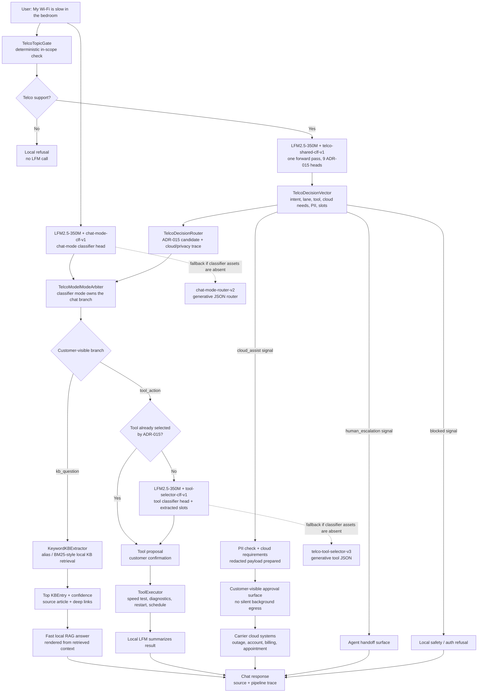

# Telco Triage iOS

Telco Triage is a SwiftUI reference app for a private, on-device home internet
support assistant powered by Liquid Foundation Models.

The app demonstrates an edge-first support architecture that is relevant to
carriers, banks, retailers, and any customer-facing mobile app with a long tail
of support requests:

1. A compact LFM runs in the iOS app.
2. A shared telco classifier adapter produces nine support decisions in one
   forward pass.
3. Classifier heads arbitrate chat mode and tool selection on the low-latency
   path; generative LoRA routers remain available as fallback.
4. Cloud assist receives only a redacted support bundle, and only when the
   workflow needs live account, billing, outage, or appointment systems.

This is a carrier-agnostic example. The Xcode project, scheme, app target,
source module, bundle ID, and visible app name are all generic Telco Triage
values.

## Demo Video

[](https://www.loom.com/share/fe2ca71564c64bcea75a74848582f5dc)

Watch the demo:
[Telco Triage local-first support assistant](https://www.loom.com/share/fe2ca71564c64bcea75a74848582f5dc)

## What This Shows

- Real LFM inference on device, not a scripted frontend.
- One resident LFM2.5-350M base model with LoRA adapters.
- Nine ADR-015 classifier heads for support routing, cloud requirements,
  escalation risk, PII risk, tool selection, transcript quality, and slot
  completeness.
- Classifier-backed chat routing and tool selection for sub-second tool cards.
- Local support tools such as restart router, speed test, diagnostics, WPS,
  extender reboot, and technician scheduling.
- A visible pipeline trace for model latency, confidence, route, and tool
  selection.
- Optional audio and vision pack scaffolding for voice support and visual
  troubleshooting.

The reference implementation is deliberately transparent. LFMs emit typed
signals, typed policy enforces privacy and approval boundaries, and the UI
shows enough trace detail for developers and customers to inspect why a request
stayed local or moved toward cloud assist.

## Architecture



The model boundary is intentional. ADR-015 produces the rich telco trace and
cloud-assist signals; classifier-backed mode routing owns the conversational
mode boundary; ADR-015 or the classifier-backed tool selector owns tool choice.
The generative chat/tool adapters are packaged as fallback paths, not the
normal low-latency critical path. The app uses typed policy to compose those
model outputs into auditable behavior.

For the slow-Wi-Fi prompt, the expected model signals are
`support_intent=troubleshooting` from ADR-015 and `mode=kb_question` from the
chat-mode classifier head. That sends the request to local RAG instead of a
diagnostics tool card. The retriever selects a local article and the app renders
a concise customer answer from that article on the critical path. Freeform
grounded generation is still available behind an environment flag for model
experiments, but the public demo keeps the customer experience aligned with the
low-latency architecture. Customer-owned facts such as SSID are answered from
`CustomerContext`; how-to SSID questions are answered from the local KB. Cloud
assist is reserved for live outage/account/billing/appointment systems and is
represented in the demo as a redacted, customer-visible payload prepared for
integration.

## Model Artifacts

Large GGUF files are intentionally not committed to the cookbook repository.
The small classifier head files and metadata are committed under
`TelcoTriage/Resources/`.

The model architecture and distribution rationale are covered in
[MODELS.md](MODELS.md). In short: app source, sample data, manifests, and small
classifier heads belong in Git; full GGUF artifacts belong in a versioned model
registry or in a packaged demo build.

Required local GGUFs:

| File | Purpose |
| --- | --- |
| `lfm25-350m-base-Q4_K_M.gguf` | Resident LFM2.5-350M base model |
| `telco-shared-clf-v1.gguf` | Shared classifier LoRA for the nine telco heads |
| `chat-mode-clf-v1.gguf` | Fast chat-mode classifier adapter |
| `tool-selector-clf-v1.gguf` | Fast tool-selection classifier adapter |
| `kb-extract-clf-v1.gguf` | Transitional KB classifier adapter and head pairing |
| `telco-tool-selector-v3.gguf` | Tool selection and argument adapter |
| `chat-mode-router-v2.gguf` | Dedicated chat-mode adapter for question vs action routing |
| `kb-extractor-v1.gguf` | Grounded KB answer adapter |

The classifier adapters are what keep the visible demo path fast. The
generative chat/tool adapters are still useful for fallback experiments and for
teams comparing classifier-head routing against JSON-generating routers.

Put these files in `examples/telco-triage-ios/models/telco/`, or set
`TELCO_MODELS_DIR` to a directory containing them.

## Run Locally

Requirements:

- Xcode 15+
- iOS 17+ simulator or device
- `xcodegen`

Install XcodeGen if needed:

```bash
brew install xcodegen
```

Prepare and open the app:

```bash
cd examples/telco-triage-ios

# Option A: models live in ./models/telco
./bootstrap-models.sh

# Option B: models live elsewhere
TELCO_MODELS_DIR=/path/to/telco-models ./bootstrap-models.sh

xcodegen generate
open TelcoTriage.xcodeproj
```

Then run the `TelcoTriage` scheme. The display name on device is
`Telco Triage`.

## Validation

Fast non-LFM unit tests:

```bash
cd examples/telco-triage-ios
xcodegen generate
xcodebuild test \
  -project TelcoTriage.xcodeproj \
  -scheme TelcoTriage \
  -destination 'platform=iOS Simulator,name=iPhone 17 Pro' \
  -skip-testing:TelcoTriageTests/LFMValidationTests \
  -skip-testing:TelcoTriageTests/LlamaBackendSmokeTests
```

Full model smoke tests require the GGUFs to be copied with
`./bootstrap-models.sh`.

## Demo Prompts

Try these in the Chat tab:

```text
Restart my router
Run a speed test
My wifi is slow in the bedroom
Can you tell me what's my SSID?
What do the lights on my router mean?
Block my son's tablet from the internet
Is there an outage in my area?
Why is my bill higher this month?
I want to talk to a person
```

Engineering mode expands each response with the local model route, classifier
confidence, retrieval result, selected tool, latency, and cloud-assist posture.

## Extension Points

Telco Triage is designed to be adapted without changing the core inference
architecture:

| Area | Extension point |
| --- | --- |
| Knowledge | `TelcoTriage/Resources/knowledge-base.json` |
| Branding | `TelcoTriage/Core/Branding/` |
| Local actions | `TelcoTriage/Core/Tools/` and `ToolRegistry` |
| Routing taxonomy | ADR-015 classifier labels and deterministic router policy |
| Cloud assist | Redacted payload contract for live carrier systems |

## Notes

- Use the **Base** LFM2.5-350M GGUF. The included LoRA adapters were trained
  against Base weights.
- The iOS Simulator runs without GPU offload, so physical devices are more
  representative for latency.
- The project and module are named `TelcoTriage`; carrier-specific forks can
  keep that stable or rename it deliberately with XcodeGen.
