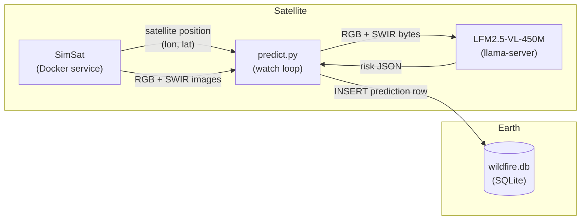
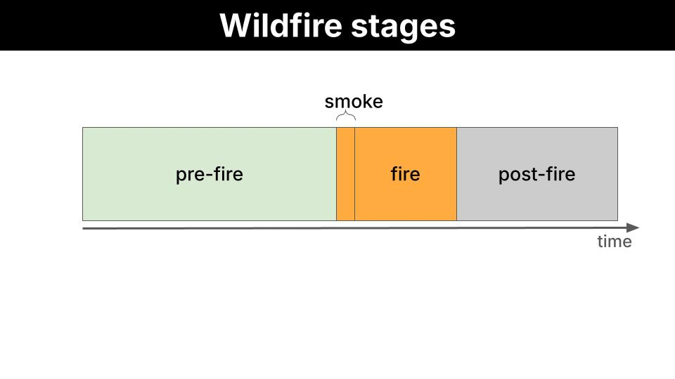
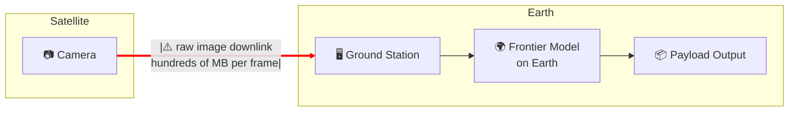
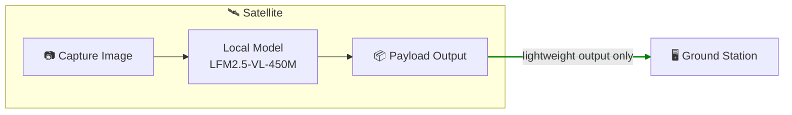
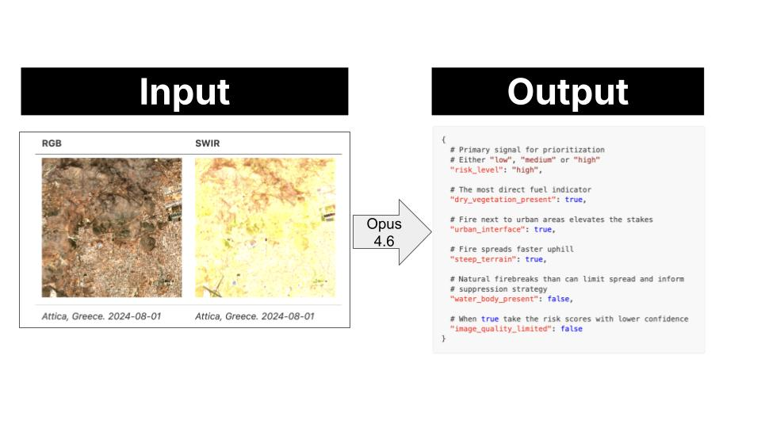
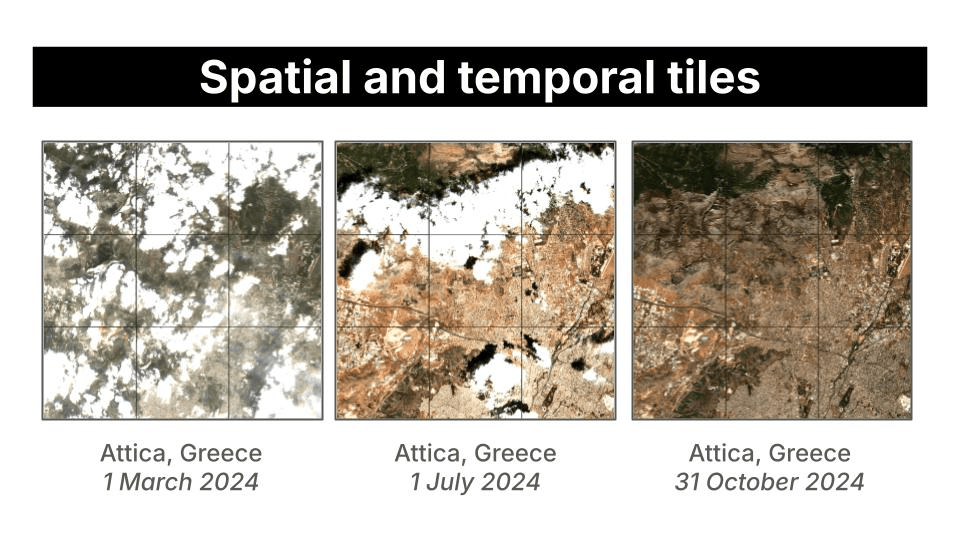
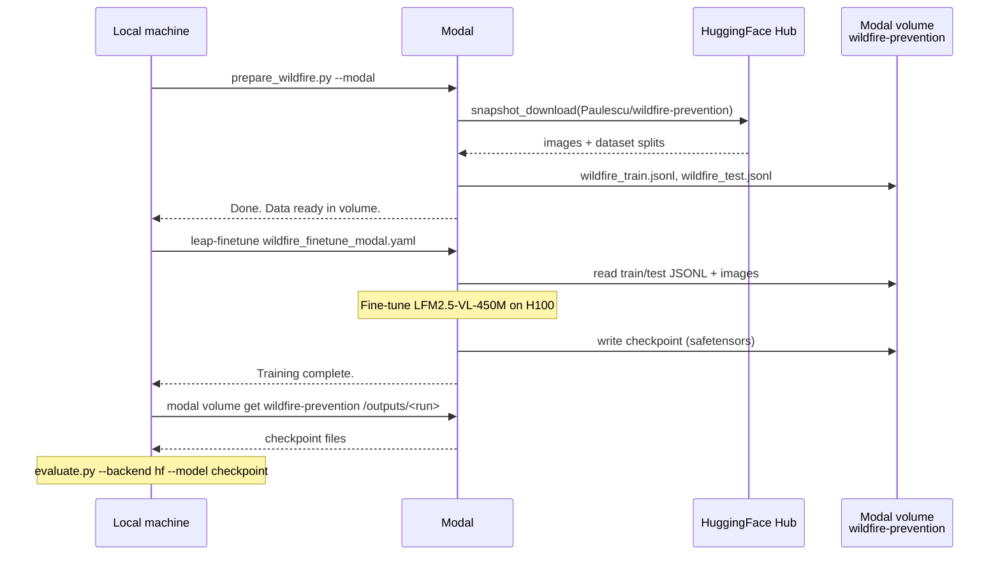

# Let's build a wildfire prevention system using a compact Vision-Language Modell and Sentinel-2 satellite images

In this example you will learn how to build a basic wildfire prevention system using:

- Sentinel-2 satellite images
- A compact Vision-Language Model (LFM2.5-VL, 450M parameters) running directly on the satellite, so inference happens in orbit and only a lightweight JSON payload is downlinked to Earth.



We will cover all the stages of the journey:

## Steps
- [Problem framing](#1-problem-framing)
- [System design](#2-system-design)
- [Data collection and labeling](#3-data-collection-and-labeling-pipeline)
- [Evaluation](#4-evaluation)
- [Fine-tuning](#5-fine-tuning)


## 1. Problem framing

We want to reduce the number of wildfires by identifying areas with high-risk from Sentinel-2 images, and providing actionable feedback to local authorities like firefighters so they can act before the fire has even started.



> **What is Sentinel-2?**
>
> Sentinel-2 is a European Space Agency (ESA) satellite mission that captures high-resolution optical imagery of Earth's surface. It's part of the EU's Copernicus programme.
>
> It consists of 3 satellites (Sentinel-2A, 2B and 2C) which orbit in tandem:
>
> - Revisiting the same location **every 5 days** at the equator (more frequently at higher latitudes).
> - Capturing **multispectral** images. Instead of capturing a single photograph, they measure reflected light across **13 discrete wavelength ranges** simultaneously. Each range is called a band, and each band carries some information about vegetation health, water content, soil moisture or atmospheric conditions that is not visible to the naked eye.

In this repository we will use two different images for a given location:

- **RGB (B4-B3-B2):** natural color. Useful for reading urban texture, terrain shape from shadows, and water bodies.
- **SWIR (B12-B8-B4):** shortwave infrared. Highlights vegetation moisture stress and dryness, the primary fuel indicator.

Using this input, we can extract early signs of vegeatation distress, or urban risk, and alert local authorities

Let's go through an example:

### Example

1. A Sentinel-2 satellite flies over *Attica (Greece)* on 2024-08-01, and takes these 2 pictures.

    | RGB | SWIR |
    |-----|------|
    |  |  |
    | *Attica, Greece. 2024-08-01* | *Attica, Greece. 2024-08-01* |

2. This image pair is passed to the Vision-Language Model, which has holistic scene understanding, not just pixel-level statistics, and the model extracts the following risk profile.

    ```json
    {
      # Primary signal for prioritization
      # Either "low", "medium" or "high"
      "risk_level": "high",

      # The most direct fuel indicator
      "dry_vegetation_present": true,
      
      # Fire next to urban areas elevates the stakes
      "urban_interface": true,
      
      # Fire spreads faster uphill
      "steep_terrain": true,

      # Natural firebreaks than can limit spread and inform
      # suppression strategy
      "water_body_present": false,

      # When true take the risk scores with lower confidence 
      "image_quality_limited": false
    }
    ```

3. This payload is downlinked to ground control on Earth. As the image tile has high risk, the system sends an alert to local fire services. These can then take precautionary measures like
    - ground patrol deployment or
    - controlled burns to reduce available fuel.


## 2. System design

### Design rationale

You could point a frontier model (GPT-5, Gemini 2.0 Flash, or Claude 3.6 Sonnet) at satellite images and it would do a good job. So why bother using a smaller one that needs fine-tuning?

The bottleneck is not capability. It is **data transmission**.

A frontier model runs on a server on Earth. To use it:

- The satellite downlinks raw images to a ground station.
- The ground station feeds the model.
- The model produces the output on Earth.

Images are high-dimensional: large matrices of pixel values per band, per frame. Multiply that by the number of captures per orbit, and you have a serious bandwidth problem.



A small model removes that bottleneck entirely. At 450M parameters, LFM2.5-VL-450M is compact enough to run directly on the satellite:

- The satellite captures the image and runs inference on-board.
- The local model produces the payload output in orbit.
- Only the lightweight output is downlinked to the ground station.



### Proof of Concept (PoC)

Rather than building a full satellite stack, we simulate the on-board pipeline locally using three components:

- **[SimSat](https://github.com/DPhi-Space/SimSat):** a local Docker service that simulates a satellite orbit and serves real Sentinel-2 imagery from the AWS Element84 STAC catalog. It provides the satellite's current position and the corresponding RGB and SWIR images.
- **`predict.py`:** a lightweight Python watch loop that polls SimSat for the current position, fetches the images, and drives the inference pipeline.
- **LFM2.5-VL-450M:** the local model running via `llama-server`, playing the role of the on-board VLM.


The system monitors 22 fixed locations. Each location is a single 5 km tile centered on a known fire-prone coordinate. One prediction is produced per location per satellite pass. These are the locations we monitor:

| id | Location |
|----|----------|
| `angeles_nf_ca` | Angeles National Forest, California |
| `santa_barbara_ca` | Santa Barbara, California |
| `napa_valley_ca` | Napa Valley, California |
| `sierra_nevada_ca` | Sierra Nevada, California |
| `alentejo_portugal` | Alentejo, Portugal |
| `attica_greece` | Attica, Greece |
| `cerrado_brazil` | Cerrado, Brazil |
| `patagonia_argentina` | Patagonia, Argentina |
| `black_forest_germany` | Black Forest, Germany |
| `scottish_highlands` | Scottish Highlands |
| `borneo_rainforest` | Borneo Rainforest |
| `tanzania_savanna` | Tanzania Savanna |
| `outback_nsw_australia` | Outback NSW, Australia |
| `victorian_alpine_au` | Victorian Alps, Australia |
| `kalahari_botswana` | Kalahari, Botswana |
| `zagros_iran` | Zagros Mountains, Iran |
| `negev_israel` | Negev Desert, Israel |
| `alpine_switzerland` | Swiss Alps |
| `amazon_brazil` | Amazon, Brazil |
| `congo_basin_drc` | Congo Basin, DRC |
| `lahaina_maui_hi` | Lahaina, Maui, Hawaii |
| `mati_attica_gr` | Mati, Attica, Greece |

### Quickstart

1. Clone the SimSat repository:

    ```bash
    git clone https://github.com/DPhi-Space/SimSat.git
    cd SimSat
    ```

2. Start SimSat (keep it running in a separate terminal):

    ```bash
    docker compose up
    ```

3. Open the SimSat dashboard at [http://localhost:8000](http://localhost:8000), click **Start**, and verify the satellite position is moving.

4. Install Python dependencies:

    ```bash
    uv sync
    ```

5. Start the watch loop:

    ```bash
    # Watch all 22 locations
    uv run scripts/predict.py --backend local --model LiquidAI/LFM2.5-VL-450M-GGUF --quant Q8_0

    # Watch a single location
    uv run scripts/predict.py --backend local --model LiquidAI/LFM2.5-VL-450M-GGUF --quant Q8_0 --location attica_greece
    ```

6. Optionally, backfill historical predictions to seed the database before the live loop. For each location and day, backfill writes the RGB and SWIR images to `db_images/{row_id}/` on disk and inserts the prediction into `wildfire.db`, linked by row ID.

    ```bash
    # All locations, last 7 days
    uv run scripts/backfill.py --backend local --model LiquidAI/LFM2.5-VL-450M-GGUF --quant Q8_0 --days 7

    # Single location, last 90 days (builds a seasonal dataset)
    uv run scripts/backfill.py --backend local --model LiquidAI/LFM2.5-VL-450M-GGUF --quant Q8_0 --days 90 --location attica_greece
    ```

7. Once the database has predictions, launch the app:

    ```bash
    uv run streamlit run app/app.py
    ```

## 3. Data collection and labeling pipeline

We use `claude-opus-4-6` to label a dataset of satellite image pairs.



The dataset is built from a cross-product of locations, spatial tiles, and temporal tiles, then split into train and test by a temporal cutoff.



To run the data collection and labeling pipeline you will need an Anthropic API key.

```bash
export ANTHROPIC_API_KEY=sk-...

# All 22 locations, push final dataset to Hugging Face
uv run scripts/generate_samples.py \
  --start-date 2024-01-01 --end-date 2025-12-31 \
  --n-temporal-tiles 12 --n-spatial-tiles 4 \
  --test-ratio 0.2 --concurrency 3 \
  --hf-dataset your-username/wildfire-risk

# Only 1 region, Attica, Greece
uv run scripts/generate_samples.py \
    --start-date 2024-01-01 --end-date 2024-12-31 \
    --n-temporal-tiles 12 --n-spatial-tiles 4 \
    --test-ratio 0.2 --concurrency 3 \
    --location attica_greece
```

For each `(location, spatial tile, timestamp)` triple, `generate_samples.py` does the following:

1. Creates a timestamped run directory under `data/` (e.g., `data/20260416_143052/`).

2. Samples `--n-temporal-tiles` timestamps evenly spaced within `[--start-date, --end-date]` using bin-center placement, so timestamps are always in the interior of the window.

    ```
    Jan 2024                                       Dec 2024
    │                                                    │
    │   t00    t01    t02    t03    t04    t05           │
    │    ●      ●      ●      ●      ●      ●            │
    ├────┴──────┴──────┴──────┴──────┼──────┴────────────┤
    │                                │                   │
    │           train                │       test        │
    │         (80% of window)        │   (20% of window) │
    └────────────────────────────────┴───────────────────┘
                                    ↑
                                    cutoff
    ```

3. Builds a centered square grid of `--n-spatial-tiles` tiles around each location center, spaced `--size-km` apart.

    ```
    ┌─────────┬─────────┬─────────┐
    │   s00   │   s01   │   s02   │
    ├─────────┼─────────┼─────────┤
    │   s03   │   s04   │   s05   │   ← s04 = location center
    ├─────────┼─────────┼─────────┤
    │   s06   │   s07   │   s08   │
    └─────────┴─────────┴─────────┘
            ←  5 km  →
    ```

4. Fetches the RGB and SWIR images in parallel from SimSat for each `(spatial tile, timestamp)` pair.

5. Saves `rgb.png` and `swir.png` to the tile subfolder.

6. Sends both images to `claude-opus-4-6` for risk annotation, with automatic retry on rate-limit errors.

7. Saves the structured JSON output as `annotation.json`.

8. Assigns the tile to `train/` or `test/` based on a temporal cutoff: `cutoff = start + (1 - test_ratio) × duration`. All tiles with `timestamp < cutoff` go to `train/`, the rest go to `test/`. This prevents near-duplicate images (Sentinel-2 revisits every 5 days) from appearing on both sides of the split. Tiles are indexed row-major from the top-left of the grid. For a 3×3 grid (`n_spatial_tiles=9`), `s04` is the location center. `t00` is always the earliest timestamp. Indices are zero-padded.

    ```
    data/20260416_143052/
      train/
        attica_greece/
          s00_t00/        <- spatial tile 0, temporal tile 0 (earliest timestamp)
            rgb.png
            swir.png
            annotation.json
          s00_t01/
          s01_t00/
          ...
      test/
        attica_greece/
          s00_t09/        <- same spatial tiles, later timestamps
          ...
    ```

9. Optionally packages the run in [leap-finetune](https://github.com/LiquidAI/leap-finetune) VLM SFT format and pushes `train.jsonl` and `test.jsonl` to Hugging Face Hub (`--hf-dataset`).

To validate a run:

```bash
uv run scripts/check_samples.py                  # most recent run
uv run scripts/check_samples.py 20260416_143052  # specific run
```

The dataset used in the rest of this guide is [Paulescu/wildfire-prevention](https://huggingface.co/datasets/Paulescu/wildfire-prevention). To reproduce it exactly you just need to run, and replace `Paulescu/wildfire-detection` with `YOUR_HF_USER_NAME/DATASET_NAME`

```bash
uv run scripts/generate_samples.py \
  --start-date 2024-01-01 --end-date 2025-12-31 \
  --n-temporal-tiles 12 \
  --n-spatial-tiles 4 \
  --test-ratio 0.2 \
  --concurrency 4 \
  --hf-dataset Paulescu/wildfire-prevention
```

## 4. Evaluation

The evaluation pipeline runs a model against a generated dataset and measures how closely its predictions match the Opus-generated ground truth annotations.

```bash
# Evaluate Claude Opus 4.6 (sanity check)
uv run scripts/evaluate.py \
    --hf-dataset Paulescu/wildfire-prevention \
    --backend anthropic 
    --split test

# Evaluate LFM2.5-VL-450M-GGUF at q8_0 quantization
uv run scripts/evaluate.py \
  --hf-dataset Paulescu/wildfire-prevention \
  --backend local \
  --model LiquidAI/LFM2.5-VL-450M-GGUF \
  --quant Q8_0 \
  --split test
```

Each run saves three files to `evals/{timestamp}/`:
- `report.md`: human-readable accuracy table
- `results.json`: per-sample records with the model's actual predictions, ground truth, and per-field match results
- `meta.json`: run metadata (model, dataset, backend, split)

Once you have two or more eval runs, launch the comparison app to explore results visually:

```bash
uv run streamlit run app/eval_compare.py
```

[DIAGRAM]

### Results

Evaluated on 22 locations ([Paulescu/wildfire-prevention](https://huggingface.co/datasets/Paulescu/wildfire-prevention)), ground truth from `claude-opus-4-6`.

| field | claude-opus-4-6 | LFM2.5-VL-450M Q8_0 |
|---|---|---|
| valid_json | 1.00 | 1.00 |
| fields_present | 1.00 | 1.00 |
| risk_level | 0.99 | 0.08 |
| dry_vegetation_present | 0.99 | 0.48 |
| urban_interface | 0.98 | 0.25 |
| steep_terrain | 0.99 | 0.45 |
| water_body_present | 0.99 | 0.74 |
| image_quality_limited | 1.00 | 0.28 |
| **overall** | **0.99** | **0.38** |
| **avg latency (s)** | **2.91** | **0.72** |


## 5. Fine-tuning

We use [leap-finetune](https://github.com/LiquidAI/leap-finetune) to fine-tune `LFM2.5-VL-450M` on the Opus-labeled dataset via Modal's serverless H100 infrastructure.



### Steps

1. Clone [leap-finetune](https://github.com/Liquid4All/leap-finetune) inside this project directory and install its dependencies:

    ```bash
    git clone https://github.com/LiquidAI/leap-finetune.git
    cd leap-finetune && uv sync && cd ..
    ```

2. Authenticate:

    ```bash
    cd leap-finetune
    uv run huggingface-cli login   # needed to pull the model and dataset
    uv run python -m modal setup   # needed to launch the training job
    cd ..
    ```

3. Prepare the dataset and push it to a Modal volume:

    ```bash
    uv run scripts/prepare_wildfire.py --dataset Paulescu/wildfire-prevention --modal
    ```

    The `--modal` flag spins up a Modal container, downloads the dataset from HuggingFace, converts it to JSONL, and writes everything to a Modal volume named `wildfire-prevention`. The volume is then used directly by the training job in the next step.

4. Run the fine-tuning:

    ```bash
    cd leap-finetune && uv run leap-finetune ../configs/wildfire_finetune_modal.yaml
    ```

    Training progress is visible at [https://huggingface.co/spaces/Paulescu/wildfire-prevention-finetune](https://huggingface.co/spaces/Paulescu/wildfire-prevention-finetune).

5. Retrieve the checkpoint

    ```bash
    uv run modal volume ls wildfire-prevention /outputs/
    uv run modal volume get wildfire-prevention /outputs/<run-name> ./outputs
    ```

6. Quantize the model

    [TODO]

7. Evaluate the fine-tuned model. Use `--backend hf` to load the safetensors checkpoint directly, or `--backend local` to use the quantized GGUF from step 6:

    ```bash
    # Evaluate via HuggingFace transformers (safetensors checkpoint)
    uv run scripts/evaluate.py \
        --hf-dataset Paulescu/wildfire-prevention \
        --backend hf \
        --model <path-to-checkpoint> \
        --split test

    # Evaluate via llama-server (quantized GGUF from step 6)
    uv run scripts/evaluate.py \
        --hf-dataset Paulescu/wildfire-prevention \
        --backend local \
        --model ./outputs/lfm2.5-vl-wildfire-Q8_0.gguf \
        --split test
    ```

