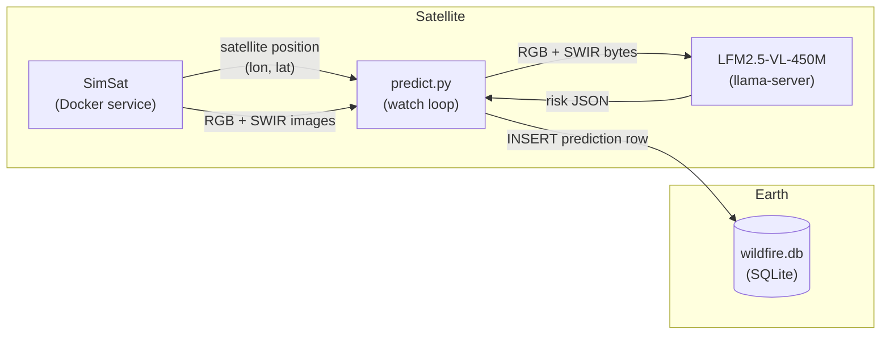

# Let's build a wildfire prevention system

## Table of contents

- [Goal](#goal)
- [Problem framing](#problem-framing)
- [System design](#system-design)
- [Generate sample data](#generate-sample-data)
- [Evaluate](#evaluate)

---

In this example you will learn how to

- frame the problem
- get high quality labeled data
- evaluate LFM2.5-VL-450M on this task.
- fine-tune it to boost performance.

## Goal

In the hackathon we have access to Sentinel-2 images. Images for the same tile of land are typically available at a 5-10 day frequency.
Wildfires spread way faster than that, so we cannot use Sentinel-2 images to build a system that early detects smoke and alerts.
We need to build something that works at a lower frequency and focus on prevention.

Moreover, the focus of this tutorial is on VLMs, so we want to pick a task and dataset for which pixel-by-pixel measures are not enough, and a more holistic scene understanding is necessary to assess risk. In other words, we want to justify the added complexity of using a VLM by framing a task that really requires a VLM.

The output this VLM produces does not need to be very complex. This is a demo, not a full project. The goal is to guide hackathon participants through a working example, and let them focus on details, or alternative paths we encounter along the way.

## Problem framing

We want the VLM to assess the **wildfire risk level** of a land tile based on scene-level understanding. Specifically, it should identify:
- Whether dry, burnable vegetation is present
- Whether human infrastructure sits at the wildland-urban interface
- Whether terrain features (slopes, ridges) would accelerate fire spread
- Whether natural firebreaks (rivers, reservoirs) are present

[HERE]

This task requires holistic scene understanding, not pixel-level statistics. A pixel-level index like NDVI can tell you that vegetation is stressed, but it cannot tell you that it is dense dry chaparral sitting uphill from a residential neighborhood in an open wind corridor. That contextual judgment is exactly what a VLM is for.

**What images should we provide the VLM?**

Two Sentinel-2 composites per land tile, passed together in a single model call:
- RGB (bands B4-B3-B2): natural color, useful for terrain and infrastructure
- SWIR (bands B12-B8-B4): highlights vegetation moisture stress and dryness

**What is the output format?**

A compact JSON object with one categorical field and five boolean flags:

```json
{
  "risk_level": "low | medium | high",
  "dry_vegetation_present": true,
  "urban_interface": false,
  "steep_terrain": true,
  "water_body_present": false,
  "image_quality_limited": false
}
```

The boolean schema is intentionally simple: each flag is a direct, observable binary signal from the images, making model evaluation straightforward.

## System design



The system monitors a named geographic region using a grid of 5 km tiles. Both the live watch loop and the historical backfill operate on the same tile grid, so their predictions are colocated in the database and directly comparable in the app.

Available regions:

| id | Name |
|----|------|
| `collserola` | Parc de Collserola, Barcelona |
| `garraf` | Parc del Garraf, Barcelona |
| `montseny` | Parc Natural del Montseny |
| `donana` | Parque Nacional de Doñana, Huelva |
| `sierra_nevada` | Parque Nacional Sierra Nevada, Granada |

### Live watch loop

`predict.py` polls the current satellite position from SimSat every `--interval` seconds. With `--region` the loop only scores tiles that belong to that region; when the satellite is outside it logs a skip line so you can confirm the loop is alive. Without `--region` every position is scored.

**Before running `predict.py`, start the SimSat orbit simulation:**

1. Open the SimSat dashboard at [http://localhost:8000](http://localhost:8000)
2. Click **Start** to begin the satellite orbit simulation
3. Verify the satellite position is moving (the `/data/current/position` endpoint should return coordinates other than `(0.0, 0.0)`)

Without this step, SimSat returns a static position at `(0.0, 0.0)` (ocean, no Sentinel coverage) and `predict.py` will loop without producing any predictions.

```bash
# Score every satellite position worldwide (runs until Ctrl+C)
uv run scripts/predict.py --backend anthropic

# Only score tiles within the Garraf park
uv run scripts/predict.py --backend anthropic --region garraf

# Local model, region-constrained
uv run scripts/predict.py --backend local --model LiquidAI/LFM2.5-VL-450M-GGUF --quant Q8_0 --region collserola

# Tune the poll interval
uv run scripts/predict.py --backend anthropic --region garraf --interval 10
```

When `--region` is set, tile center coordinates are used for DB storage (not the raw satellite position), so live and backfill predictions land on the same grid points.

### Historical backfill

`backfill.py` fetches historical Sentinel-2 images from SimSat for every tile in a region's grid across the last N days. Use this to seed the database before starting the live loop, or to build a seasonal time-series.

```bash
# Garraf, last 7 days
uv run scripts/backfill.py --backend anthropic --days 7 --region garraf

# Collserola, last 90 days (builds a seasonal dataset)
uv run scripts/backfill.py --backend anthropic --days 90 --region collserola

# Local model
uv run scripts/backfill.py --backend local --model LiquidAI/LFM2.5-VL-450M-GGUF --quant Q8_0 --days 7 --region montseny
```

### App

Once the database has predictions, launch the Streamlit app:

```bash
uv run streamlit run app/app.py
```

The app renders each tile's RGB image at its geographic bounding box with a colored dot for the predicted risk level (green/orange/red). Select a region in the sidebar to zoom the map to that area and reveal two time-series charts: per-tile risk lines and a region-level average with a min/max shaded band. Enable "Auto-refresh" to have the map update automatically as `predict.py` writes new rows to the database.

## Generate sample data

Images are fetched via [SimSat](https://github.com/DPhi-Space/SimSat), a local Docker service that wraps the Sentinel-2 STAC catalog on AWS Element84.

Images are fetched at 5 km tiles (`--size-km 5.0`), which keeps images at or below 512x512 px — the native resolution of LFM2.5-VL-450M — avoiding tiling overhead at inference time.

```bash
# 1. Start SimSat (from the SimSat repo root, keep it running in a separate terminal)
docker compose up

# 2. Install Python dependencies
uv sync

# 3. Set your Anthropic API key
export ANTHROPIC_API_KEY=sk-...

# 4. Generate sample images and Opus 4.6 annotations (22 locations, 3 parallel workers)
uv run scripts/generate_samples.py --size-km 5.0 --concurrency 3
```

Each run creates a timestamped folder under `data/`, e.g.:

```
data/
  20260416_143052/
    angeles_nf_ca/
      rgb.png
      swir.png
      annotation.json
    alentejo_portugal/
    ...
```

To validate a run:

```bash
uv run scripts/check_samples.py                  # most recent run
uv run scripts/check_samples.py 20260416_143052  # specific run
```

## Evaluate

The evaluation pipeline runs a model against a generated dataset and measures how closely its predictions match the Opus-generated ground truth annotations.

```bash
# Anthropic backend (checks Opus self-consistency)
uv run scripts/evaluate.py --dataset data/20260416_141946 --backend anthropic

# Local backend via llama-server (requires llama.cpp on PATH)
uv run scripts/evaluate.py \
  --dataset data/20260416_141946 \
  --backend local \
  --model LiquidAI/LFM2.5-VL-450M-GGUF \
  --quant Q8_0
```

Each run saves a report to `evals/{timestamp}/report.md`.

### Results

Evaluated on 22 locations (`data/20260416_141946`), ground truth from `claude-opus-4-6`.

| field | claude-opus-4-6 | LFM2.5-VL-1.6B Q8_0 | LFM2.5-VL-450M Q8_0 |
|---|---|---|---|
| valid_json | 1.00 | 1.00 | 1.00 |
| fields_present | 1.00 | 1.00 | 1.00 |
| risk_level | 0.95 | 0.18 | 0.18 |
| dry_vegetation_present | 0.95 | 0.73 | 0.73 |
| urban_interface | 1.00 | 0.73 | 0.45 |
| steep_terrain | 1.00 | 0.73 | 0.59 |
| water_body_present | 1.00 | 0.73 | 0.77 |
| image_quality_limited | 1.00 | 0.68 | 0.18 |
| **overall** | **0.97** | **0.63** | **0.48** |
| **avg latency (s)** | **2.89** | **2.07** | **0.71** |

Opus at 0.97 confirms the ground truth labels are highly reproducible. Both LFM models produce valid, well-structured JSON (1.00) but struggle with `risk_level` and `image_quality_limited`, which are the primary targets for fine-tuning. The 1.6B model improves meaningfully over 450M (0.63 vs 0.48) at ~3x higher latency.

## Tasks

- [x] Clearly define the problem we are solving
- [x] Generate a sample of images and check output produced by Opus 4.6
- [ ] Fine-tune LFM2.5-VL-450M to boost performance
