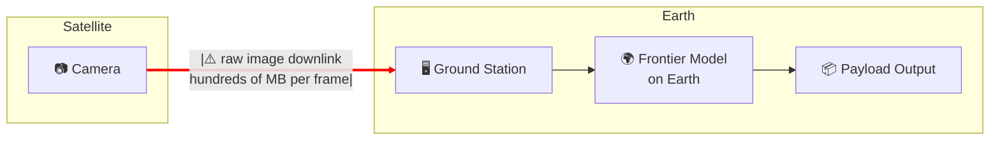
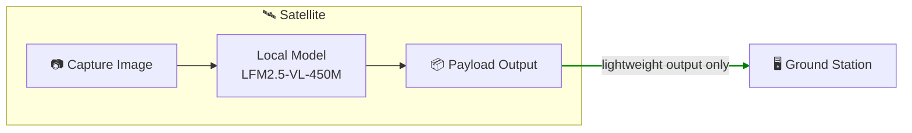
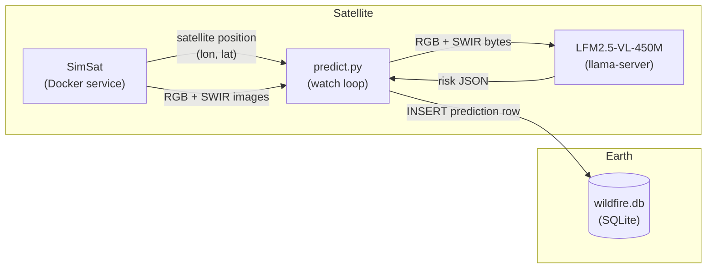

# Let's build a wildfire prevention system using a compact Vision-Language Modell and Sentinel-2 satellite images

In this example you will learn how to build a basic wildfire prevention system using:

- Sentinel-2 satellite images
- A compact Vision-Language Model (LFM2.5-VL, 450M parameters) running directly on the satellite, so inference happens in orbit and only a lightweight JSON payload is downlinked to Earth.

We will cover all the stages of the journey:

- [Problem framing](#problem-framing)
- [System design](#system-design)
  - [Design rationale](#design-rationale)
  - [Proof of Concept (PoC)](#proof-of-concept-poc)
  - [Live watch loop](#live-watch-loop)
  - [Historical backfill](#historical-backfill)
  - [App](#app)
- [Data collection and labeling](#generate-sample-data)
- [Evaluation](#evaluate)
- [Fine-tuning](#fine-tuning)


## Problem framing

We want to reduce the number of wildfires by identifying areas with high-risk from Sentinel-2 images, and providing actionable feedback to local authorities like firefighters so they can act before the fire has even started.

> **What is Sentinel-2?**
>
> Sentinel-2 is a European Space Agency (ESA) satellite mission that captures high-resolution optical imagery of Earth's surface. It's part of the EU's Copernicus programme.
>
> It consists of 3 satellites (Sentinel-2A, 2B and 2C) which orbit in tandem:
>
> - Revisiting the same location **every 5 days** at the equator (more frequently at higher latitudes).
> - Capturing **multispectral** images. Instead of capturing a single photograph, they measure reflected light across **13 discrete wavelength ranges** simultaneously. Each range is called a band, and each band carries some information about vegetation health, water content, soil moisture or atmospheric conditions that is not visible to the naked eye.

In this repository we will use two different images for a given location:

- **RGB (B4-B3-B2):** natural color. Useful for reading urban texture, terrain shape from shadows, and water bodies.
- **SWIR (B12-B8-B4):** shortwave infrared. Highlights vegetation moisture stress and dryness, the primary fuel indicator.

Using this input, we can extract early signs of vegeatation distress, or urban risk, and alert local authorities

Let's go through an example:

### Example

1. A Sentinel-2 satellite flies over *Attica (Greece)* on  2024-08-01, and takes these 2 pictures.

    | RGB | SWIR |
    |-----|------|
    |  |  |
    | *Attica, Greece. 2024-08-01* | *Attica, Greece. 2024-08-01* |

2. This image pair is passed to the Vision-Language Model, which has holistic scene understanding, not just pixel-level statistics, and the model extracts the following risk profile.

    ```json
    {
      # Primary signal for prioritization
      # Either "low", "medium" or "high"
      "risk_level": "high",

      # The most direct fuel indicator
      "dry_vegetation_present": true,
      
      # Fire next to urban areas elevates the stakes
      "urban_interface": true,
      
      # Fire spreads faster uphill
      "steep_terrain": true,

      # Natural firebreaks than can limit spread and inform
      # suppression strategy
      "water_body_present": false,

      # When true take the risk scores with lower confidence 
      "image_quality_limited": false
    }
    ```

3. This payload is downlinked to ground control on Earth. As the image tile has high risk, the system sends an alert to local fire services. These can then take precautionary measures like
    - ground patrol deployment or
    - controlled burns to reduce available fuel.


## System design

### Design rationale

You could point a frontier model (GPT-5, Gemini 2.0 Flash, or Claude 3.6 Sonnet) at satellite images and it would do a good job. So why bother using a smaller one that needs fine-tuning?

The bottleneck is not capability. It is data transmission.

A frontier model runs on a server on Earth. To use it:

- The satellite downlinks raw images to a ground station.
- The ground station feeds the model.
- The model produces the output on Earth.

Images are high-dimensional: large matrices of pixel values per band, per frame. Multiply that by the number of captures per orbit, and you have a serious bandwidth problem.



A small model removes that bottleneck entirely. At 450M parameters, LFM2.5-VL-450M is compact enough to run directly on the satellite:

- The satellite captures the image and runs inference on-board.
- The local model produces the payload output in orbit.
- Only the lightweight output is downlinked to the ground station.



### Proof of Concept (PoC)

Rather than building a full satellite stack, we simulate the on-board pipeline locally using three components:

- **[SimSat](https://github.com/DPhi-Space/SimSat):** a local Docker service that simulates a satellite orbit and serves real Sentinel-2 imagery from the AWS Element84 STAC catalog. It provides the satellite's current position and the corresponding RGB and SWIR images.
- **`predict.py`:** a lightweight Python watch loop that polls SimSat for the current position, fetches the images, and drives the inference pipeline.
- **LFM2.5-VL-450M:** the local model running via `llama-server`, playing the role of the on-board VLM.



The system monitors 22 fixed locations. Each location is a single 5 km tile centered on a known fire-prone coordinate. One prediction is produced per location per satellite pass. These are the locations we monitor:

| id | Location |
|----|----------|
| `angeles_nf_ca` | Angeles National Forest, California |
| `santa_barbara_ca` | Santa Barbara, California |
| `napa_valley_ca` | Napa Valley, California |
| `sierra_nevada_ca` | Sierra Nevada, California |
| `alentejo_portugal` | Alentejo, Portugal |
| `attica_greece` | Attica, Greece |
| `cerrado_brazil` | Cerrado, Brazil |
| `patagonia_argentina` | Patagonia, Argentina |
| `black_forest_germany` | Black Forest, Germany |
| `scottish_highlands` | Scottish Highlands |
| `borneo_rainforest` | Borneo Rainforest |
| `tanzania_savanna` | Tanzania Savanna |
| `outback_nsw_australia` | Outback NSW, Australia |
| `victorian_alpine_au` | Victorian Alps, Australia |
| `kalahari_botswana` | Kalahari, Botswana |
| `zagros_iran` | Zagros Mountains, Iran |
| `negev_israel` | Negev Desert, Israel |
| `alpine_switzerland` | Swiss Alps |
| `amazon_brazil` | Amazon, Brazil |
| `congo_basin_drc` | Congo Basin, DRC |
| `lahaina_maui_hi` | Lahaina, Maui, Hawaii |
| `mati_attica_gr` | Mati, Attica, Greece |

### Quickstart

1. Clone the SimSat repository:

    ```bash
    git clone https://github.com/DPhi-Space/SimSat.git
    cd SimSat
    ```

2. Start SimSat (keep it running in a separate terminal):

    ```bash
    docker compose up
    ```

3. Open the SimSat dashboard at [http://localhost:8000](http://localhost:8000), click **Start**, and verify the satellite position is moving.

4. Install Python dependencies:

    ```bash
    uv sync
    ```

5. Start the watch loop:

    ```bash
    # Watch all 22 locations
    uv run scripts/predict.py --backend local --model LiquidAI/LFM2.5-VL-450M-GGUF --quant Q8_0

    # Watch a single location
    uv run scripts/predict.py --backend local --model LiquidAI/LFM2.5-VL-450M-GGUF --quant Q8_0 --location attica_greece
    ```

6. Optionally, backfill historical predictions to seed the database before the live loop:

    ```bash
    # All locations, last 7 days
    uv run scripts/backfill.py --backend local --model LiquidAI/LFM2.5-VL-450M-GGUF --quant Q8_0 --days 7

    # Single location, last 90 days (builds a seasonal dataset)
    uv run scripts/backfill.py --backend local --model LiquidAI/LFM2.5-VL-450M-GGUF --quant Q8_0 --days 90 --location attica_greece
    ```

7. Once the database has predictions, launch the app:

    ```bash
    uv run streamlit run app/app.py
    ```

## Data collection and labeling

Images are fetched via [SimSat](https://github.com/DPhi-Space/SimSat), a local Docker service that wraps the Sentinel-2 STAC catalog on AWS Element84.

[ADD DIAGRAM SIMSAT COMPONENTS]

Images are fetched at 5 km tiles (`--size-km 5.0`), which keeps images at or below 512x512 px — the native resolution of LFM2.5-VL-450M — avoiding tiling overhead at inference time.

```bash
# 1. Start SimSat (from the SimSat repo root, keep it running in a separate terminal)
docker compose up

# 2. Install Python dependencies
uv sync

# 3. Set your Anthropic API key
export ANTHROPIC_API_KEY=sk-...

# 4. Generate sample images and Opus 4.6 annotations (22 locations, 3 parallel workers)
uv run scripts/generate_samples.py --size-km 5.0 --concurrency 3
```

Each run creates a timestamped folder under `data/`, e.g.:

```
data/
  20260416_143052/
    angeles_nf_ca/
      rgb.png
      swir.png
      annotation.json
    alentejo_portugal/
    ...
```

To validate a run:

```bash
uv run scripts/check_samples.py                  # most recent run
uv run scripts/check_samples.py 20260416_143052  # specific run
```

## Evaluate

The evaluation pipeline runs a model against a generated dataset and measures how closely its predictions match the Opus-generated ground truth annotations.

```bash
# Anthropic backend (checks Opus self-consistency)
uv run scripts/evaluate.py --dataset data/20260416_141946 --backend anthropic

# Local backend via llama-server (requires llama.cpp on PATH)
uv run scripts/evaluate.py \
  --dataset data/20260416_141946 \
  --backend local \
  --model LiquidAI/LFM2.5-VL-450M-GGUF \
  --quant Q8_0
```

Each run saves a report to `evals/{timestamp}/report.md`.

### Results

Evaluated on 22 locations (`data/20260416_141946`), ground truth from `claude-opus-4-6`.

| field | claude-opus-4-6 | LFM2.5-VL-1.6B Q8_0 | LFM2.5-VL-450M Q8_0 |
|---|---|---|---|
| valid_json | 1.00 | 1.00 | 1.00 |
| fields_present | 1.00 | 1.00 | 1.00 |
| risk_level | 0.95 | 0.18 | 0.18 |
| dry_vegetation_present | 0.95 | 0.73 | 0.73 |
| urban_interface | 1.00 | 0.73 | 0.45 |
| steep_terrain | 1.00 | 0.73 | 0.59 |
| water_body_present | 1.00 | 0.73 | 0.77 |
| image_quality_limited | 1.00 | 0.68 | 0.18 |
| **overall** | **0.97** | **0.63** | **0.48** |
| **avg latency (s)** | **2.89** | **2.07** | **0.71** |

Opus at 0.97 confirms the ground truth labels are highly reproducible. Both LFM models produce valid, well-structured JSON (1.00) but struggle with `risk_level` and `image_quality_limited`, which are the primary targets for fine-tuning. The 1.6B model improves meaningfully over 450M (0.63 vs 0.48) at ~3x higher latency.

## Tasks

- [x] Clearly define the problem we are solving
- [x] Generate a sample of images and check output produced by Opus 4.6
- [ ] Fine-tune LFM2.5-VL-450M to boost performance
